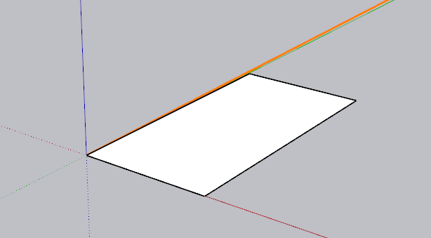
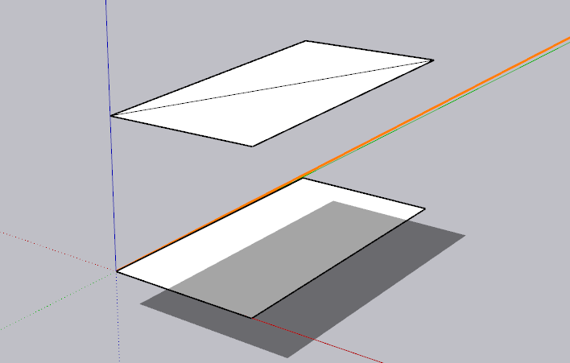
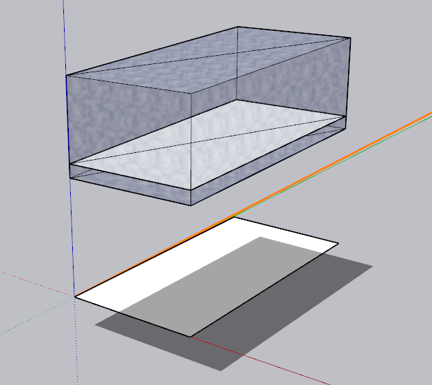

# Summary of Western Australian Parcel Representation Examples

## Table of Contents

1. [Purpose](#purpose)
2. [Comparison of the examples](#comparison-of-the-examples)
3. [Important distinctions](#important-distinctions)
4. [Possible forms of derived 3D geometry](#possible-forms-of-derived-3d-geometry)
5. [Overall message](#overall-message)
6. [Main dataset pattern differences](#main-dataset-pattern-differences)
7. [Examples](#examples)
8. [Discussion points](#discussion-points)
9. [Relationship between the footprint and the derived solid](#relationship-between-the-footprint-and-the-derived-solid)
10. [Refactor of Types 1 to 7 into a single general pattern](#refactor-of-types-1-to-7-into-a-single-general-pattern)

## Purpose

These examples demonstrate how vertical information can be added progressively to a Western Australian cadastral parcel without incorrectly implying that every parcel has a legally defined 3D extent.
They cover many existing practices used in WA today.

They are a starting point for discussion. Some normalisation may be possible.

The following vocabularies (and their responsibilities) have been compiled to support the examples:

| Vocabulary                                                                                                                                                    | Question answered                                                          |
|---------------------------------------------------------------------------------------------------------------------------------------------------------------|----------------------------------------------------------------------------|
| [Representation Status](https://github.com/surroundaustralia/3d-csdm-profile-wa/blob/main/proposals/development/vocabularies/representation-status.csv)       | What representation is present?                                            |
| [Geometry Legal Status](https://github.com/surroundaustralia/3d-csdm-profile-wa/blob/main/proposals/development/vocabularies/geometry-legal-status.csv)       | What is the legal or analytical status of the geometry?                    |
| [Vertical Extent Status](https://github.com/surroundaustralia/3d-csdm-profile-wa/blob/main/proposals/development/vocabularies/vertical-extent-status.csv)     | What is the overall legal or source state of the parcel’s vertical extent? |
| [Computability Status](https://github.com/surroundaustralia/3d-csdm-profile-wa/blob/main/proposals/development/vocabularies/computability-status.csv)         | Can the boundary or extent be computed from available inputs?              |
| [Height Reference](https://github.com/surroundaustralia/3d-csdm-profile-wa/blob/main/proposals/development/vocabularies/height-reference.csv)                 | Relative to what surface, level, object, or plane is a boundary described? |
| [Vertical Boundary State](https://github.com/surroundaustralia/3d-csdm-profile-wa/blob/main/proposals/development/vocabularies/vertical-boundary-state.csv)   | What is the state of the upper or lower boundary?                          |
| [Vertical Definition Type](https://github.com/surroundaustralia/3d-csdm-profile-wa/blob/main/proposals/development/vocabularies/vertical-definition-type.csv) | What kind of source definition establishes the boundary?                   |
| [Vertical Limit Role](https://github.com/surroundaustralia/3d-csdm-profile-wa/blob/main/proposals/development/vocabularies/vertical-limit-role.csv)           | Is the definition an upper or lower limit?                                 |
| [Vertical Value Type](https://github.com/surroundaustralia/3d-csdm-profile-wa/blob/main/proposals/development/vocabularies/vertical-value-type.csv)           | How is the limit expressed?                                                |
| [Vertical Direction](https://github.com/surroundaustralia/3d-csdm-profile-wa/blob/main/proposals/development/vocabularies/vertical-direction.csv)             | What direction is the limit expressed?                                     |
| [Coordinate Z Role](https://github.com/surroundaustralia/3d-csdm-profile-wa/blob/main/proposals/development/vocabularies/coordinate-z-role.csv)               | What do coordinate `z` values mean?                                        |


The key principle is:

> A parcel remains an authoritative 2D parcel unless a legal vertical extent is explicitly described, supported by an authoritative source, and, where a 3D solid is created, capable of being computed and validated.

Refer to Use Case: [Represent a WA 2D parcel with height descriptions and derived 3D extent](https://github.com/surroundaustralia/3d-csdm-profile-wa/blob/main/proposals/use-cases/2-5d-liminal.md) for requirements.

## Comparison of the examples

| Example                                                            | What is represented                                                                                                                        |                Legal vertical extent? | 3D solid? | Main distinction                                                                                                                                                                |
|--------------------------------------------------------------------|--------------------------------------------------------------------------------------------------------------------------------------------|--------------------------------------:|----------:|---------------------------------------------------------------------------------------------------------------------------------------------------------------------------------|
| **1. Authoritative 2D parcel footprint**                           | The surveyed horizontal parcel boundary only; the current default.                                                                         |                                    No |        No | A valid cadastral parcel does not require vertical information. The absence of vertical limits does not mean that the parcel extends infinitely.                                |
| **2. 2D parcel with geometry `z` values**                          | A 2D parcel footprint with heights recorded on points or other geometry; the default where `z`-values are included for each point.         |                                    No |        No | Geometry `z` values may describe point or observation heights, but they are not legal parcel limits and must not be treated as `zMin` or `zMax`.                                |
| **3. 2.5D surface-bounded parcel**                                 | A 2D parcel footprint with an associated terrain, ground, floor, or reference surface.                                                     |                                    No |        No | The surface provides vertical context for analysis or visualisation. It does not define the parcel’s legal upper or lower boundary.                                             |
| **4. 2D parcel with a relative vertical relationship description** | A 2D footprint with a description such as a distance above or below ground, a floor, or another reference surface.                         |      Described but not yet computable |        No | The relationship may be legally meaningful, but absolute limits cannot be calculated until the required reference surface and method are available.                             |
| **5. 2D parcel with an absolute height relationship description**  | A 2D footprint with an absolute height or depth limit referenced to a datum such as AHD.                                                   |             Yes, for the stated limit |        No | A supported value may be recorded as `zMin` or `zMax`, but one height limit does not create a closed 3D parcel volume.                                                          |
| **6. Jurisdictionally bounded parcel**                             | A 2D footprint with vertical limits defined by a title, plan, statute, Crown Grant, strata statement, or approved rule.                    | Yes, where the source or rule applies |        No | The legal source, wording, authority, affected parcel and limit role must be explicit. Jurisdictional limits must not be assumed or applied silently.                           |
| **7. Derived 3D solid**                                            | A closed 3D volume generated from the 2D footprint, computable upper and lower boundaries, and any required surfaces or height references. |       Based on the source information |       Yes | A solid may only be generated when sufficient legal, geometric and computational information is available. The source information, method and provenance must remain traceable. |

## Important distinctions

### Geometry is not necessarily legal extent

The following may provide useful vertical information but do not, by themselves, define a legal 3D parcel:

- geometry `z` values;
- terrain, ground or floor surfaces;
- the lowest or highest available elevation;
- a visualised or analytical volume; or
- an unresolved relative height description.

### A legal description is not necessarily a 3D solid

A parcel may have a legally meaningful vertical limit without having a closed 3D volume.

For example:

- an upper AHD limit may define `zMax` without defining `zMin`;
- a Crown Grant may define a depth below ground without the required ground surface being available; or
- a jurisdictional rule may define a boundary condition that cannot yet be converted into coordinates.

Missing limits must not be invented.

If an authoritative source establishes that a parcel is unconstrained in one or both vertical directions, that could be documented as:

```json
{
  "representationStatus": "representation-status:2d",
  "geometryLegalStatus": "geometry-legal-status:a2d",
  "verticalExtentStatus": [
    "vertical-extent-status:uca",
    "vertical-extent-status:ucb"
  ],
  "computabilityStatus": "computability-status:nc"
}
```

### Requirements for a derived 3D solid

A derived 3D solid requires, as applicable:

- an authoritative 2D footprint;
- a legally supported upper boundary;
- a legally supported lower boundary;
- any required reference surface;
- an appropriate horizontal and vertical CRS or datum;
- a documented computation method;
- a closed and topologically valid shell;
- an explicit geometry classification; and
- complete derivation provenance and source traceability.

## Possible forms of derived 3D geometry

Different derived 3D solids may be produced where sufficient information is available. For example, a solid may be derived from:

- absolute upper and lower AHD limits;
- a relative height or depth together with a reference surface;
- a jurisdictional rule that has been resolved into computable boundaries;
- a combination of planar and non-planar boundary surfaces; or
- a legal description converted into geometry for analysis or visualisation.

Each solid must state whether it is:

- legally authoritative;
- derived from a legal description;
- analytical;
- approximate; or
- visualisation-only.

A generated solid must not be treated as authoritative 3D cadastral geometry unless the jurisdiction explicitly accepts it in that role.

## Overall message

The examples represent a progression from:

**2D footprint → vertical context → legal vertical description → computable vertical boundaries → derived 3D solid**

Progression to the next representation is only appropriate when the required information is available and traceable. 
No representation should imply greater legal or geometric certainty than is supported by its source information.

## Main dataset pattern differences

### Common pattern

All seven stages retain the parcel’s identity and authoritative horizontal footprint.

The progression does not replace the original 2D parcel boundary. Instead, each stage adds a different type of vertical information or representation:

**2D polygon → geometry heights → reference surface → vertical description → legal limit → jurisdictional rule → derived solid**

| Stage                                  | Main dataset pattern                                                                                                                                                                   | Status pattern                                                                                                                                                                                                                                                                             | Key difference from the preceding stage                                                                                                                                                                  |
|----------------------------------------|----------------------------------------------------------------------------------------------------------------------------------------------------------------------------------------|--------------------------------------------------------------------------------------------------------------------------------------------------------------------------------------------------------------------------------------------------------------------------------------------|----------------------------------------------------------------------------------------------------------------------------------------------------------------------------------------------------------|
| **1. Authoritative 2D footprint**      | The parcel is represented by a polygon referencing its surveyed boundary edges. No vertical CRS, height description, surface, shell or solid is required to be included.               | `representationStatus`:`2d`; `vertical-extent-status`: `undefined` or `uca`or `ucb` or (`uca` and `ucb`); `geometryLegalStatus`: `a2d`; `computabilityStatus`: `nc`                                                                                                                        | Establishes the authoritative 2D parcel as the baseline representation. If `z` is not defined as unbounded use `ud`, otherwise `uca` and /or `ucb` plus `sourceDocument` plus `PROV`                     |
| **2. 2D footprint with `z` values**    | The same 2D parcel pattern is retained, but some points or geometry coordinates include a third ordinate.                                                                              | Remains `2D`; vertical extent remains `undefined` or `uca`or `ucb` or (`uca` and `ucb`) `geometryLegalStatus`: `a2d`; `computabilityStatus`: `nc`, may include `verticalCrs`                                                                                                               | Adds coordinate heights only. May include height datum, but the `z` values are not parcel limits and do not alter the parcel representation. Otherwise the same **1. Authoritative 2D footprint** above. |
| **3. 2.5D reference surface**          | A vertical CRS and surface topology are added. The surface is represented through points, edges, rings, faces and a surface shell, and the parcel references that surface.             | `2.5D`; vertical extent is `notApplicable`; geometry legal status: `authoritative2D`; not computable as a solid/volume; requires `verticalCrs`; requires `surface` topology; requires `surface` `PROV` (expect it to the the same as the survey `PROV`). `surface` must contain 2D parcel. | Organises height values into a surface bounded by the footprint. The surface provides context but is not a legal parcel boundary.                                                                        |
| **4. Relative height description**     | The parcel remains a 2D polygon. A structured `heightDescription` records the reference, offset, upper or lower role, source and provenance.                                           | `heightDescribed`; vertical extent `requiresResolution`; requires a reference surface                                                                                                                                                                                                      | Replaces surface context with a legally meaningful relationship, such as a distance above or below ground. The relationship cannot yet be converted into absolute boundaries.                            |
| **5. Absolute AHD height description** | The parcel remains a 2D polygon. An `absoluteHeight` structure records supported `zMin` and/or `zMax` values, units, source wording and provenance.                                    | `heightDescribed`; vertical extent `legallyDefined`; computable                                                                                                                                                                                                                            | Converts the vertical description into absolute values referenced to a vertical datum. No 3D topology or solid is created.                                                                               |
| **6. Jurisdictionally bounded parcel** | The parcel remains a 2D polygon. A `jurisdictionalBoundaryRule` records the source authority, source statement, boundary role, reference, offset and provenance.                       | `jurisdictionallyBounded`; vertical extent `legallyDefined`; computability depends on the rule and required inputs                                                                                                                                                                         | Makes the legal or jurisdictional basis explicit. The boundary is defined by a title, Crown Grant, statute or other rule rather than by geometry alone.                                                  |
| **7. Derived 3D solid**                | The original footprint is retained and the parcel gains a `solidRef`. Derived points, edges, rings, faces, upper and lower surfaces, side faces, a closed shell and a solid are added. | `derived3D`; vertical extent `derivedFromLegalDescription`; computed and derived                                                                                                                                                                                                           | Converts sufficient source information into a closed 3D volume. The derivation inputs, parameters, method, validation results and provenance are recorded.                                               |


## Examples

The examples below are an initial draft of an encoding for describing the various types of 2D and 3D parcel representations outlined in this document.
The examples focus on the parcel properties for each type of representation.
`sourceDocuments` and `hasProvenance` elements have not been populated, but examples for these elements follow the `parcel` examples.
It is assumed that these elements will follow the patterns outlined in the examples.

### Authoritative 2D footprint **and** 2D footprint with `z` values

<figure class="fig fig-wide">
  
  <figcaption id="figure-1-parcel-on-datum">Figure 1: Parcel on Datum</figcaption>
</figure>

If `z` is not defined as unbounded:

```json
{
  "horizontalCRS": "epsg:8031",
  "points": [
  ],
  "edges": [
  ],
  "parcels": [
    {
      "features": [
        {
          "properties": {
            "representationStatus": "representation-status:2d",
            "geometryLegalStatus": "geometry-legal-status:a2d",
            "verticalExtentStatus": "vertical-extent-status:ud",
            "computabilityStatus": "computability-status:nc"
          }
        }
      ]
    }
  ]
}
```

If `z` is unbounded, expand `verticalExtentStatus` to include `unconstrainedAbove` and or `unconstrainedBelow`, add `sourceDocuments` and relevant `PROV`.:

```json
{
  "horizontalCRS": "epsg:8031",
  "points": [
  ],
  "edges": [
  ],
  "parcels": [
    {
      "features": [
        {
          "properties": {
            "representationStatus": "representation-status:2d",
            "geometryLegalStatus": "geometry-legal-status:a2d",
            "verticalExtentStatus": [
              "vertical-extent-status:uca",
              "vertical-extent-status:ucb"
            ],
            "computabilityStatus": "computability-status:nc"
          }
        }
      ]
    }
  ],
  "sourceDocuments": [
  ],
  "hasProvenance": [
  ]
}
```
### 2.5D reference surface

<figure class="fig fig-wide">
  
  <figcaption id="figure-2-parcel-with-surface">Figure 2: Parcel on Datum with Ground Surface</figcaption>
</figure>

Same general pattern as **Authoritative 2D footprint and 2D footprint with `z` values** above. Requires `verticalCrs`, requires `points`, `edges`, `rings`, `faces`, and `shell`. Parcel must reference `surface`. `surface` must be a valid open `shell`. `surface` must contain 2D parcel. May benefit `PROV` describing how the surface was computed.

```json
{
  "horizontalCRS": "epsg:8031",
  "verticalCRS": "epsg:5711",
  "points": [
  ],
  "edges": [
  ],
  "rings": [
  ],
  "faces": [
  ],
  "shells": [
  ],
  "parcels": [
    {
      "features": [
        {
          "properties": {
            "representationStatus": "representation-status:2-5d",
            "geometryLegalStatus": "geometry-legal-status:a2d",
            "verticalExtentStatus": "vertical-extent-status:na",
            "computabilityStatus": "computability-status:nc",
            "surface": {
              "type": "height-reference:gl",
              "status": "geometry-legal-status:obs",
              "ref": "uuid:ca9c4381-9422-4bbb-8f05-c8a835831933"
            },
            "surfaceBoundedByFootprint": "True"
          }
        }
      ]
    }
  ],
  "hasProvenance": [
  ]
}
```

### Relative height description

Requires authoritative 2D footprint; Requires horizontal CRS; requires height description; requires height expression; requires height reference/surface reference to resolve Solid geometry; requires height description `PROV`;

```json
{
  "horizontalCRS": "epsg:8031",
  "points": [
  ],
  "edges": [
  ],
  "parcels": [
    {
      "features": [
        {
          "properties": {
            "representationStatus": "representation-status:hd",
            "verticalExtentStatus": "vertical-extent-status:rr",
            "geometryLegalStatus": "geometry-legal-status:a2d",
            "computabilityStatus": "computability-status:rrs",
            "heightDescription": {
              "type": "relativeHeightDescription",
              "heightReference": "height-reference:gl",
              "heightOffset": [
                {
                  "zMinDescription": "2 metres below ground level",
                  "descriptionRole": "lowerLimit",
                  "value": 2,
                  "sourceReference": "source-height-description-1"
                },
                {
                  "zMaxDescription": "12 metres above ground level",
                  "descriptionRole": "upperLimit",
                  "value": 12,
                  "sourceReference": "source-height-description-2"
                }
              ],
              "resolutionStatus": "requiresReferenceSurface",
              "resolved": false,
              "provenanceRef": "height-description-extraction-1"
            }
          }
        }
      ]
    }
  ],
  "supportingDocuments": [
  ],
  "hasProvenance": [
  ]
}
```

### Absolute AHD height description

Requires authoritative 2D footprint; Requires horizontal CRS; requires vertical CRS; requires height description; requires height value; requires height reference to be `AHD` or `EPSG:5711`; requires `zMin`/`zMax`; requires `zMin`/`zMax` descriptions; requires source document; requires height description `PROV`;

```json
{
  "horizontalCRS": "epsg:8031",
  "verticalCRS": "epsg:5711",
  "points": [
  ],
  "edges": [
  ],
  "parcels": [
    {
      "features": [
        {
          "properties": {
            "representationStatus": "representation-status:hd",
            "verticalExtentStatus": "vertical-extent-status:ld",
            "geometryLegalStatus": "geometry-legal-status:a2d",
            "computabilityStatus": "computability-status:c",
            "absoluteHeight": {
              "maxHeight": {
                "zMax": 35.0,
                "zMaxDescription": "limited in height to less than and equal to 35.00 AHD",
                "sourceReference": "source-height-description-1"
              },
              "minHeight": {
                "zMin": 16.0,
                "zMinDescription": "limited in height to more than and equal to 16.00 AHD",
                "sourceReference": "source-height-description-2"
              },
              "resolved": false,
              "provenanceRef": "uuid:height-description-extraction-1"
            }
          }
        }
      ]
    }
  ],
  "supportingDocuments": [
  ],
  "hasProvenance": [
  ]
}
```

### Jurisdictionally bounded parcel

Requires horizontal CRS; requires height description; requires jurisdictional source, rule, role, and authority; requires `zMin` / `zMax` plus descriptions and source; requires `PROV`.

```json
{
  "horizontalCRS": "epsg:8031",
  "verticalCRS": "epsg:5711",
  "points": [
  ],
  "edges": [
  ],
  "parcels": [
    {
      "features": [
        {
          "properties": {
            "representationStatus": "representation-status:jb",
            "verticalExtentStatus": "vertical-extent-status:ld",
            "geometryLegalStatus": "geometry-legal-status:a2d",
            "computabilityStatus": "computability-status:rrs",
            "jurisdictionalBoundaryRule": {
              "ruleType": "crownGrantDepthLimit",
              "sourceAuthorityType": "CrownGrant",
              "sourceStatement": "LIMITED IN DEPTH TO 12.19 METRES BELOW GROUND",
              "limitRole": "vertical-limit-role:ll",
              "heightReference": "groundLevel",
              "heightOffset": {
                "value": 12.19,
                "direction": "vertical-direction:blw"
              },
              "sourceReference": "source-crown-grant-depth-limit-1",
              "provenanceRef": "crown-grant-depth-limit-extraction-1"
            }
          }
        }
      ]
    }
  ],
  "supportingDocuments": [
  ],
  "hasProvenance": [
  ]
}
```

### Derived 3D solid

<figure class="fig fig-wide">
  
  <figcaption id="figure-3-parcel-with-solid">Figure 3: Parcel on Datum with derived 3D Solid</figcaption>
</figure>

Required authoritative 2D footprint; requires horizontal and vertical CRS; depending on how the solid is defined a `surface` may be required; the surface should contain the footprint; depending on how the solid is defined a height description, AHD description, or jurisdictional description will be required (as per the relevant example above); `zMin`/`zMax` and associated descriptors may be required as per the relevant example above; `edge`, `ring`, `face`, `shell` and `solid` topology should be valid; the `solid` should be consistent with the footprint and the vertical limits; relevant `PROV` and `sourceDocuments` should be referenced for specifying and deriving the `solid`; the geometry legal status should be `derivedFromLegalDescription`.

```json
{
  "horizontalCRS": "epsg:8031",
  "points": [
  ],
  "edges": [
  ],
  "rings": [
  ],
  "faces": [
  ],
  "shells": [
  ],
  "solids": [
  ],
  "parcels": [
    {
      "features": [
        {
          "properties": {
            "representationStatus": "representation-status:d3d",
            "verticalExtentStatus": "vertical-extent:dfld",
            "geometryLegalStatus": "geometry-legal-status:dfld",
            "computabilityStatus": "computability-status:cd",
            "heightDescription": {
              "type": "relativeHeightDescription",
              "heightReference": "height-reference:gl",
              "heightOffset": [
                {
                  "zMinDescription": "2 metres below ground level",
                  "descriptionRole": "lowerLimit",
                  "value": 2,
                  "sourceReference": "source-height-description-1"
                },
                {
                  "zMaxDescription": "12 metres above ground level",
                  "descriptionRole": "upperLimit",
                  "value": 12,
                  "sourceReference": "source-height-description-2"
                }
              ],
              "resolutionStatus": "requiresReferenceSurface",
              "resolved": false,
              "provenanceRef": "height-description-extraction-1"
            },
            "solidRef": "uuid:fbefade9-9cda-4826-9327-3ba8796191f5",
            "surface": {
              "type": "height-reference:gl",
              "status": "geometry-legal-status:obs",
              "ref": "uuid:ca9c4381-9422-4bbb-8f05-c8a835831933"
            },
            "surfaceBoundedByFootprint": "True",
            "sourceReference": "source-surface-offset-1",
            "provenanceRef": "surface-offset-extraction-1"
          }
        }
      ]
    }
  ],
  "supportingDocuments": [
  ],
  "hasProvenance": [
  ]
}
```

### Sample `PROV` declaration for a jurisdictional boundary rule

```json
{
  "id": "crown-grant-depth-limit-extraction-1",
  "activityType": "jurisdictional-boundary-rule-extraction",
  "activityName": "Extract Crown Grant depth limitation from Certificate of Title",
  "used": [
    {
      "id": "source-ct-2500-584",
      "type": "prov:Entity",
      "role": "sourceCertificateOfTitle",
      "interestLink": "2500-584",
      "interestType": "wa-interest-type:ct",
      "format": "title-register-record"
    },
    {
      "id": "source-ct-2500-584-depth-limit",
      "type": "prov:Entity",
      "role": "sourceJurisdictionalBoundaryStatement",
      "sourceAuthorityType": "CrownGrantCondition",
      "sourceStatement": "LIMITED IN DEPTH TO 12.19 METRES BELOW GROUND"
    },
    {
      "id": "parcel-2",
      "type": "prov:Entity",
      "role": "sourceParentParcel"
    }
  ],
  "generated": [
    {
      "id": "parcel-1/jurisdictionalBoundaryRule",
      "type": "prov:Entity",
      "role": "normalisedJurisdictionalBoundaryRule"
    },
    {
      "id": "parcel-1/jurisdictionalBoundaryRule/crownGrantDepthLimit",
      "type": "prov:Entity",
      "role": "normalisedCrownGrantDepthLimit"
    }
  ],
  "wasAssociatedWith": [
    {
      "id": "src/process_title/build_wa_title_boundary_rules.py",
      "type": [
        "prov:SoftwareAgent",
        "schema:SoftwareApplication"
      ],
      "role": "jurisdictionalBoundaryRuleExtractor",
      "description": "Python module used to extract Crown Grant depth limitations and other jurisdictional boundary rules from Certificate of Title source records."
    }
  ],
  "startedAtTime": "2026-06-15T17:47:17Z",
  "endedAtTime": "2026-06-15T17:47:17Z"
}
```

### Sample `sourceDocument` declaration for a jurisdictional boundary rule

```json
{
  "id": "source-crown-grant-depth-limit-1",
  "sourceDocumentType": "certificateOfTitle",
  "sourceDocumentReference": "2500-584",
  "interestType": "wa-interest-type:ct",
  "sourceAuthorityType": "CrownGrantCondition",
  "sourceLocation": {
    "register": "Certificate of Title",
    "titleReference": "2500/584",
    "section": "Limitations, interests, encumbrances and notifications"
  },
  "sourceStatement": "LIMITED IN DEPTH TO 12.19 METRES BELOW GROUND",
  "transcriptionStatus": "transcribed",
  "appliesTo": "parcel-2",
  "inheritedBy": [
    "parcel-1"
  ]
}
```

## Discussion points

The principal distinction between the stages is the type of information available:

1. **Stages 1–3 contain geometric information but no legal vertical extent.**
2. **Stages 4–6 contain legal or source-based vertical meaning but not necessarily a 3D volume.**
3. **Stage 7 contains computed 3D geometry because sufficient legal, geometric, and computational inputs are available.**

The important pattern is that:

- adding `z` values does not create a surface;
- adding a surface does not create a legal vertical boundary;
- adding a legal vertical description does not create a solid;
- adding one upper or lower limit does not create a closed volume; and
- a solid is created only when both boundaries and all required derivation inputs are available.

## Relationship between the footprint and the derived solid

The derived solid does not remove or replace the authoritative 2D footprint.

The dataset preserves:

- the surveyed 2D footprint as the source horizontal boundary;
- the legal description or jurisdictional rule as the source of vertical meaning;
- any reference surface or vertical datum required for calculation; and
- the derived solid as a separate, explicitly classified representation.

This allows the distinction between the **authoritative source information** and the **geometry generated from that information**.

## Refactor of Types 1 to 7 into a single general pattern

There is potential to refactor the seven patterns described above into a single general pattern. 
However, the approach should be modular and not collapse the legal distinction between stages or types.

The following offers a stable parcel structure with optional components for `z` ordinate values, reference surfaces, vertical boundary definitions, and derived 3d geometry.

### Suggested general pattern

This pattern consolidates shared behaviours while retaining critical distinctions between the various types of vertical descriptions.

It contains a `verticalBoundaryDefinitions` structure, a `definitionType` descriminator, a common `limits` array, and specilised `source` fields where required.

```json
{
  "parcels": [
    {
      "features": [
        {
          "properties": {
            "spatialRepresentationDefinitions": {
              "representationStatus": "representation-status:2d",
              "geometryLegalStatus": "geometry-legal-status:a2d",
              "coordinateRepresentation": {
                "coordinateDimension": 2,
                "zValueRole": "coordinate-z-role:absent"
              },
              "verticalExtent": {
                "status": "vertical-extent-status:ud",
                "lowerBoundary": {
                  "state": "vertical-boundary-state:und"
                },
                "upperBoundary": {
                  "state": "vertical-boundary-state:und"
                }
              },
              "computabilityStatus": "computability-status:nc",
              "verticalBoundaryDefinitions": [],
              "referenceSurfaces": [],
              "derivedGeometry": {
                "status": "notGenerated"
              }
            }
          }
        }
      ]
    }
  ]
}
```

Each stage then populates different parts of this structure.

The element `definitionType` contained in `verticalBoundaryDefinitions` distinguishes the vertical pattern.
If `definitionType` is `None` then the parcel is an authoritative 2D footprint with or without `z` coordinates, or an authoritative footprint with a 2.5D surface.
Otherwise, values must be `relativeHeightDescription`, `relativeHeightDescription`, or `jurisdictionalBoundaryRule`.

This gives software a consistent place to find vertical-boundary information without losing the important difference between the sources.

This refactoring makes explicit the semantic differences:

| Definition type              | Meaning                                                                                         |
| ---------------------------- | ----------------------------------------------------------------------------------------------- |
| `relativeHeightDescription`  | A height or depth relative to a surface or object.                                              |
| `absoluteHeightDescription`  | A directly interpretable height against AHD or another vertical datum.                          |
| `jurisdictionalBoundaryRule` | A boundary established through a title, Crown Grant, statute or other jurisdictional authority. |

In particular, the jurisdictional case must continue to preserve:

- the rule type;
- the source authority;
- the original source statement; and
- the legal object or parcel to which the rule applies.

#### Status properties remain outside the common object
The existing top-level classifications still serve useful and separate purposes:

```json
{
  "representationStatus": "representation-status:hd",
  "verticalExtentStatus": "vertical-extent-status:ld",
  "geometryLegalStatus": "geometry-legal-status:a2d",
  "computabilityStatus": "computability-status:c"
}
```
They answer different questions:

- `representationStatus`: How is the parcel currently represented?
- `verticalExtentStatus`: Does the extent have a legal or defined basis?
- `geometryLegalStatus`: Which geometry is legally authoritative?
- `computabilityStatus`: Can coordinate boundaries or geometry be calculated?

The common `verticalBoundaryDefinition` then explains why those statuses apply.

### 1 Authoritative 2D footprint

```json
{
  "spatialRepresentationDefinitions": {
    "representationStatus": "representation-status:2d",
    "geometryLegalStatus": "geometry-legal-status:a2d",
    "coordinateRepresentation": {
      "coordinateDimension": 2,
      "zValueRole": "coordinate-z-role:absent"
    },
    "verticalExtent": {
      "status": "vertical-extent-status:ud",
      "lowerBoundary": {
        "state": "vertical-boundary-state:und"
      },
      "upperBoundary": {
        "state": "vertical-boundary-state:und"
      }
    },
    "computabilityStatus": "computability-status:nc",
    "verticalBoundaryDefinitions": [],
    "referenceSurfaces": [],
    "derivedGeometry": {
      "status": "notGenerated"
    }
  }
}
```

### 2 Authoritative 2D footprint with geometry `z` values

The legal and vertical-extent patterns remain unchanged. Only the coordinate representation changes.

```json
{
  "spatialRepresentationDefinitions": {
    "representationStatus": "representation-status:2d",
    "geometryLegalStatus": "geometry-legal-status:a2d",
    "coordinateRepresentation": {
      "coordinateDimension": 3,
      "zValueRole": "coordinate-z-role:gc"
    },
    "verticalExtent": {
      "status": "vertical-extent-status:ud",
      "lowerBoundary": {
        "state": "vertical-boundary-state:und"
      },
      "upperBoundary": {
        "state": "vertical-boundary-state:und"
      }
    },
    "computabilityStatus": "computability-status:nc",
    "verticalBoundaryDefinitions": [],
    "referenceSurfaces": [],
    "derivedGeometry": {
      "status": "notGenerated"
    }
  }
}
```

This distinguishes 3D coordinates from a 3D legal parcel. 

### 3 Vertical unbounded 2D parcel

Where unboundedness is positively established by an authoritative source, it should be recorded explicitly.

```json
{
  "spatialRepresentationDefinitions": {
    "representationStatus": "representation-status:2d",
    "geometryLegalStatus": "geometry-legal-status:a2d",
    "coordinateRepresentation": {
      "coordinateDimension": 2,
      "zValueRole": "coordinate-z-role:absent"
    },
    "verticalExtent": {
      "status": "vertical-extent-status:uc",
      "lowerBoundary": {
        "state": "vertical-boundary-state:uc"
      },
      "upperBoundary": {
        "state": "vertical-boundary-state:uc"
      },
      "sourceReference": "source-unbounded-extent-rule-1"
    },
    "computabilityStatus": "computability-status:nc",
    "verticalBoundaryDefinitions": [],
    "referenceSurfaces": [],
    "derivedGeometry": {
      "status": "notGenerated"
    }
  }
}
```

The separate lower and upper boundary objects make the direction and meaning explicit.

It also supports mixed cases, such as:

```json
{
  "lowerBoundary": {
    "state": "vertical-boundary-state:def",
    "definitionRef": "limit-lower-1"
  },
  "upperBoundary": {
    "state": "vertical-boundary-state:uc"
  }
}
```

### 4 2.5D reference surface

```json
{
  "spatialRepresentationDefinitions": {
    "representationStatus": "representation-status:2-5d",
    "geometryLegalStatus": "geometry-legal-status:a2d",
    "coordinateRepresentation": {
      "coordinateDimension": 3,
      "zValueRole": "coordinate-z-role:rs"
    },
    "verticalExtent": {
      "status": "vertical-extent-status:na",
      "lowerBoundary": {
        "state": "vertical-boundary-state:na"
      },
      "upperBoundary": {
        "state": "vertical-boundary-state:na"
      }
    },
    "computabilityStatus": "computability-status:nc",
    "verticalBoundaryDefinitions": [],
    "referenceSurfaces": [
      {
        "id": "surface-ground-1",
        "surfaceType": "height-reference:gl",
        "geometryLegalStatus": "geometry-legal-status:obs",
        "ref": "uuid:ca9c4381-9422-4bbb-8f05-c8a835831933",
        "boundedByFootprint": true
      }
    ],
    "derivedGeometry": {
      "status": "notGenerated"
    }
  }
}
```

The surface is supporting geometry. 
It is not automatically an upper or lower legal boundary.

### 5 Relative height-described parcel

```json
{
  "spatialRepresentationDefinitions": {
    "representationStatus": "representation-status:hd",
    "geometryLegalStatus": "geometry-legal-status:a2d",
    "coordinateRepresentation": {
      "coordinateDimension": 2,
      "zValueRole": "coordinate-z-role:absent"
    },
    "verticalExtent": {
      "status": "vertical-extent-status:rr",
      "lowerBoundary": {
        "state": "vertical-boundary-state:dur",
        "definitionRef": "relative-limit-lower-1"
      },
      "upperBoundary": {
        "state": "vertical-boundary-state:dur",
        "definitionRef": "relative-limit-upper-1"
      }
    },
    "computabilityStatus": "computability-status:rrs",
    "verticalBoundaryDefinitions": [
      {
        "id": "relative-limit-lower-1",
        "definitionType": "vertical-definition-type:rel",
        "limitRole": "vertical-limit-role:ll",
        "valueType": "vertical-value-type:off",
        "value": 2,
        "direction": "vertical-direction:blw",
        "heightReference": "height-reference:gl",
        "description": "2 metres below ground level",
        "sourceReference": "source-height-description-1",
        "resolutionStatus": "requiresReferenceSurface",
        "provenanceRef": "height-description-extraction-1"
      },
      {
        "id": "relative-limit-upper-1",
        "definitionType": "vertical-definition-type:rel",
        "limitRole": "vertical-limit-role:ul",
        "valueType": "vertical-value-type:off",
        "value": 12,
        "direction": "vertical-direction:abv",
        "heightReference": "height-reference:gl",
        "description": "12 metres above ground level",
        "sourceReference": "source-height-description-2",
        "resolutionStatus": "requiresReferenceSurface",
        "provenanceRef": "height-description-extraction-1"
      }
    ],
    "referenceSurfaces": [],
    "derivedGeometry": {
      "status": "notGenerated"
    }
  }
}
```

### 6 Absolute AHD height-described parcel

```json
{
  "spatialRepresentationDefinitions": {
    "representationStatus": "representation-status:hd",
    "geometryLegalStatus": "geometry-legal-status:a2d",
    "coordinateRepresentation": {
      "coordinateDimension": 2,
      "zValueRole": "coordinate-z-role:absent"
    },
    "verticalExtent": {
      "status": "vertical-extent-status:ld",
      "lowerBoundary": {
        "state": "vertical-boundary-state:def",
        "definitionRef": "absolute-limit-lower-1"
      },
      "upperBoundary": {
        "state": "vertical-boundary-state:def",
        "definitionRef": "absolute-limit-upper-1"
      }
    },
    "computabilityStatus": "computability-status:c",
    "verticalBoundaryDefinitions": [
      {
        "id": "absolute-limit-lower-1",
        "definitionType": "vertical-definition-type:ahd",
        "limitRole": "vertical-limit-role:ll",
        "valueType": "vertical-value-type:ah",
        "value": 16,
        "comparisonOperator": "greaterThanOrEqual",
        "description": "limited in height to more than and equal to 16.00 AHD",
        "sourceReference": "source-height-description-2",
        "resolutionStatus": "absoluteLimitAvailable",
        "provenanceRef": "uuid:height-description-extraction-1"
      },
      {
        "id": "absolute-limit-upper-1",
        "definitionType": "vertical-definition-type:ahd",
        "limitRole": "vertical-limit-role:ul",
        "valueType": "vertical-value-type:ah",
        "value": 35,
        "comparisonOperator": "lessThanOrEqual",
        "description": "limited in height to less than and equal to 35.00 AHD",
        "sourceReference": "source-height-description-1",
        "resolutionStatus": "absoluteLimitAvailable",
        "provenanceRef": "uuid:height-description-extraction-1"
      }
    ],
    "referenceSurfaces": [],
    "derivedGeometry": {
      "status": "notGenerated"
    }
  }
}
```

### 7 Jurisdictionally bounded parcel

```json
{
  "spatialRepresentationDefinitions": {
    "representationStatus": "representation-status:jb",
    "geometryLegalStatus": "geometry-legal-status:a2d",
    "coordinateRepresentation": {
      "coordinateDimension": 2,
      "zValueRole": "coordinate-z-role:absent"
    },
    "verticalExtent": {
      "status": "vertical-extent-status:ld",
      "lowerBoundary": {
        "state": "vertical-boundary-state:dur",
        "definitionRef": "jurisdictional-limit-lower-1"
      },
      "upperBoundary": {
        "state": "vertical-boundary-state:und"
      }
    },
    "computabilityStatus": "computability-status:rrs",
    "verticalBoundaryDefinitions": [
      {
        "id": "jurisdictional-limit-lower-1",
        "definitionType": "vertical-definition-type:jur",
        "limitRole": "vertical-limit-role:ll",
        "valueType": "vertical-value-type:off",
        "value": 12.19,
        "direction": "vertical-direction:blw",
        "heightReference": "height-reference:gl",
        "description": "LIMITED IN DEPTH TO 12.19 METRES BELOW GROUND",
        "sourceReference": "source-crown-grant-depth-limit-1",
        "resolutionStatus": "requiresReferenceSurface",
        "provenanceRef": "crown-grant-depth-limit-extraction-1",
        "sourceBasis": {
          "ruleType": "crownGrantDepthLimit",
          "sourceAuthorityType": "CrownGrant",
          "sourceStatement": "LIMITED IN DEPTH TO 12.19 METRES BELOW GROUND"
        }
      }
    ],
    "referenceSurfaces": [],
    "derivedGeometry": {
      "status": "notGenerated"
    }
  }
}
```

### 8. Derived 3D solid

The derived solid uses the same vertical-boundary definitions and reference-surface patterns. 
It adds a derived-geometry component.

```json
{
  "spatialRepresentationDefinitions": {
    "representationStatus": "representation-status:d3d",
    "geometryLegalStatus": "geometry-legal-status:dfld",
    "coordinateRepresentation": {
      "coordinateDimension": 3,
      "zValueRole": "coordinate-z-role:dbg"
    },
    "verticalExtent": {
      "status": "vertical-extent-status:dfld",
      "lowerBoundary": {
        "state": "vertical-boundary-state:drv",
        "definitionRef": "relative-limit-lower-1",
        "geometryRef": "derived-lower-surface-1"
      },
      "upperBoundary": {
        "state": "vertical-boundary-state:drv",
        "definitionRef": "relative-limit-upper-1",
        "geometryRef": "derived-upper-surface-1"
      }
    },
    "computabilityStatus": "computability-status:cd",
    "verticalBoundaryDefinitions": [
      {
        "id": "relative-limit-lower-1",
        "definitionType": "vertical-definition-type:rel",
        "limitRole": "vertical-limit-role:ll",
        "valueType": "vertical-value-type:off",
        "value": 2,
        "direction": "vertical-direction:blw",
        "heightReference": "height-reference:gl",
        "description": "2 metres below ground level",
        "sourceReference": "source-height-description-1",
        "resolutionStatus": "resolved",
        "provenanceRef": "height-description-extraction-1"
      },
      {
        "id": "relative-limit-upper-1",
        "definitionType": "vertical-definition-type:rel",
        "limitRole": "vertical-limit-role:ul",
        "valueType": "vertical-value-type:off",
        "value": 12,
        "direction": "vertical-direction:abv",
        "heightReference": "height-reference:gl",
        "description": "12 metres above ground level",
        "sourceReference": "source-height-description-2",
        "resolutionStatus": "resolved",
        "provenanceRef": "height-description-extraction-1"
      }
    ],
    "referenceSurfaces": [
      {
        "id": "surface-ground-1",
        "surfaceType": "height-reference:gl",
        "geometryLegalStatus": "geometry-legal-status:obs",
        "ref": "uuid:ca9c4381-9422-4bbb-8f05-c8a835831933",
        "boundedByFootprint": true
      }
    ],
    "derivedGeometry": {
      "status": "solidGenerated",
      "geometryType": "Solid",
      "solidRef": "uuid:fbefade9-9cda-4826-9327-3ba8796191f5",
      "inputFootprintRef": "parcel-footprint-1",
      "inputDefinitionRefs": [
        "relative-limit-lower-1",
        "relative-limit-upper-1"
      ],
      "inputSurfaceRefs": [
        "surface-ground-1"
      ],
      "sourceReference": "source-surface-offset-1",
      "provenanceRef": "surface-offset-extraction-1"
    }
  }
}
```

### How the seven stages map to the common components

| Stage                | Coordinates                      | Vertical boundaries                | Surface                              | Derived geometry |
| -------------------- | -------------------------------- | ---------------------------------- | ------------------------------------ | ---------------- |
| 2D footprint         | 2D                               | Undefined                          | None                                 | None             |
| 2D with `z`          | 3D coordinates used contextually | Undefined                          | None                                 | None             |
| 2.5D surface         | 3D surface coordinates           | Not applicable as parcel limits    | Present                              | None             |
| Relative description | Usually 2D footprint             | Defined but unresolved             | Required but not necessarily present | None             |
| Absolute AHD limits  | Usually 2D footprint             | Defined and computable             | Not required                         | None             |
| Jurisdictional rule  | Usually 2D footprint             | Legally defined; may be unresolved | May be required                      | None             |
| Derived 3D           | 3D derived coordinates           | Resolved into geometry             | Present where required               | Solid present    |

### Design Rules

**1. Keep summary classifications**

```json
{
  "representationStatus": "...",
  "geometryLegalStatus": "...",
  "computabilityStatus": "..."
}
```

They provide quick classification. 
The detailed objects explain why those classifications apply.

**2. Model upper and lower boundaries separately**

This is clearer than using one scalar or array-valued `verticalExtentStatus`.

Each direction may independently be:

```text
undefined
notApplicable
unconstrained
definedButUnresolved
defined
derived
```

**3. Separate coordinate dims from legal dims**

A parcel can have:

```json
{
  "coordinateDimension": 3,
  "geometryLegalStatus": "geometry-legal-status:a2d"
}
```

This correctly represents a legally 2D parcel whose coordinates contain `z` values.

**4. Use one common boundary-definition array**

The shared `verticalBoundaryDefinitions` array can represent:

- relative offsets;
- absolute AHD values;
- jurisdictional rules;
- lower limits;
- upper limits; and
- combinations of these.

The discriminator is:
```json
{
  "definitionType": "vertical-definition-type:rel"
}

```

or:

```json
{
  "definitionType": "vertical-definition-type:ahd"
}
```

or:

```json
{
  "definitionType": "vertical-definition-type:jur"
}
```

**5. Keep derivation separate from the source definition**

A legal height description and a generated solid are different things.

The source definitions belong in:

```json
{
  "verticalBoundaryDefinitions": []
}
```

The computational result belongs in:

```json
{
  "derivedGeometry": {}
}
```

### Example files are here

1. [2D Footprint](examples/2d-footprint.json)
2. [2D Footprint with `z` ordinate](examples/2d-footprint-with-z.json)
3. [2.5D Footprint with reference surface](examples/2-5d-reference-surface.json)
4. [Height Described Relative](examples/height-described-relative.json)
5. [Height Described (AHD)](examples/height-described-ahd.json)
6. [Jurisdictionally Bounded](examples/jurisdictionally-bounded.json)
7. [Derived 3D Solid](examples/derived-3d-solid.json)


