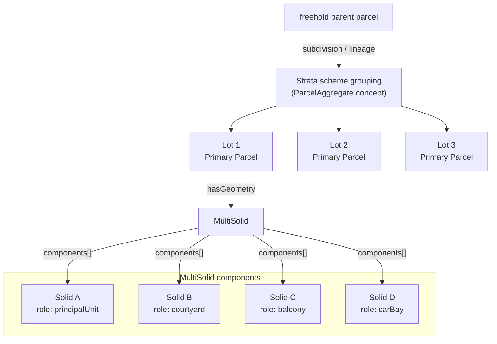
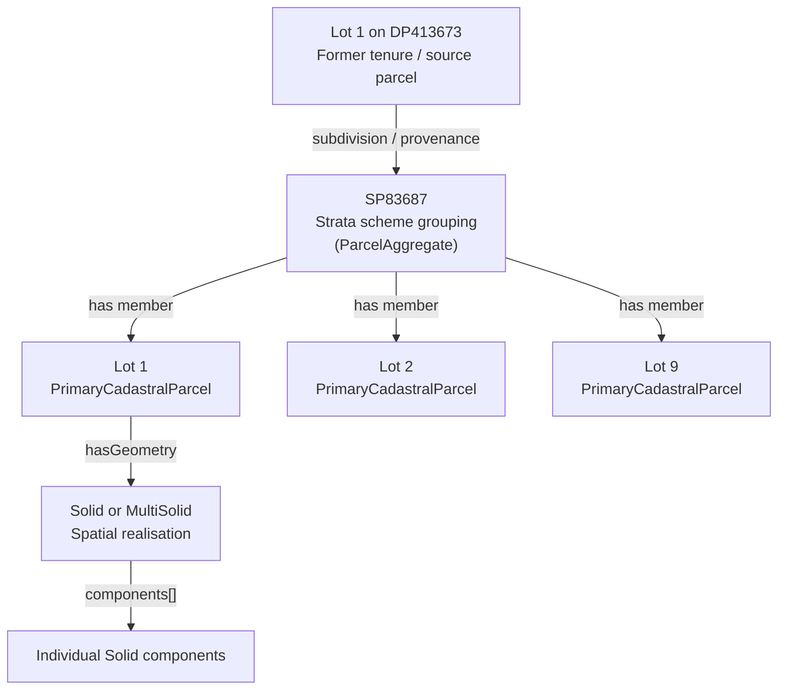
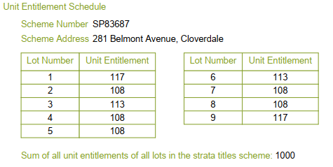
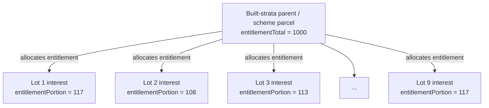
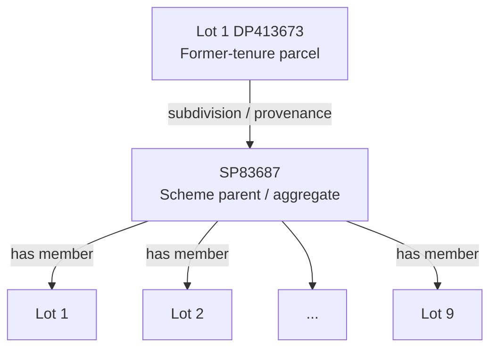
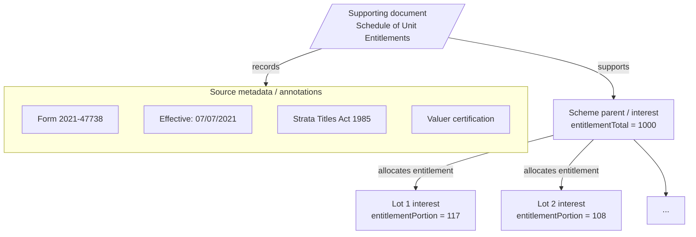

## Built Strata Parcel Specification

> The 3D CSDM generally expects that parcel identity should follow legal identity. 
> Geometry decomposition should not create additional cadastral parcels unless the source information creates additional legal parcels or spatial rights.

For Built Strata and Survey-Strata schemes, each legal strata lot shall be represented by one cadastral parcel with a `Solid` or `MultiSolid` geometry. 
Each constituent solid shall be explicitly identified and assigned a role. 
Principal units, courtyards, balconies, car bays, and similar components shall not be represented as separate cadastral parcels solely for subsequent aggregation into a legal strata lot.

## Parcel versus a geometry component

The core model already supports this distinction. 
A `CadastralParcel` may be a _single or multi area, or solid_, and a 3D spatial unit has both hasGeometry and hasGeometryPart. 
A `ParcelAggregate`, by contrast, is explicitly a collection of parcels. 
As such, the WA profile supports a 3D spatial unit represented by a closed solid or multi-solid and exposes `hasGeometryPart` for component geometry.

To maintain consistency with this framework for the built-strata use case: 
- an apartment lot is a 3D cadastral parcel; 
- a car bay or storage area is either a separate parcel if legally separate or part of the relevant lot; 
- multi-level lots remain one multipart parcel; and 
- balconies and courtyards forming part of a lot remain part of that lot.

Accordingly, the [Built Strata Overview](built-strata-overview.md) proposes a `MultiSolid` whose `components[]` reference 3D CSDM solid objects.
The components shall collectively realise one legal cadastral parcel. 
An individual component shall not imply a separate cadastral parcel or legal interest.

Conceptually represented as a flowchart, the strata lots arranged left-to-right and the `MultiSolid` components grouped in a subgraph



This results in three levels that should not be conflated:

| Level              | Meaning                                                                                |
| ------------------ | -------------------------------------------------------------------------------------- |
| Scheme/aggregate   | Groups the legal strata parcels belonging to the scheme                                |
| Cadastral parcel   | The legally recognised strata lot, with appellation, interests, unit entitlement, etc. |
| Geometry component | A spatial part contributing to the geometry of that legal lot                          |

## When should a component become a parcel?

A separately numbered car-park lot would be a parcel. 
A car bay expressly forming part of Lot 1 would be a geometry component of Lot 1. 
An exclusive-use area that remains common property should not be incorporated into Lot 1's `MultiSolid`; the working use case recommends preserving the common-property treatment and representing the exclusive-use right as an interest or secondary spatial object where legally required.

For this reason, a `ParcelAggregate` should not be used to assemble the components of a single strata lot. 
A `ParcelAggregate` is semantically stronger than a multipart geometry because it asserts that its members are themselves parcels.

> **Implementation consideration**
> 
> `ParcelAggregate` is available in the conceptual model and the WA Profile, but it does not appear to be listed in the WA Profile JSON schema’s parcels collection, which lists `PrimaryParcel` and `SecondaryParcel`. 
> The WA profile therefore needs to determine an appropriate JSON encoding for a scheme-level aggregate. 
> This of this implementation gap, it does not justify representing individual lot components as artificial cadastral parcels.

## `componentRole`

`componentRole` should describe the function of a geometry component within a parcel rather than changing the legal status of a component.
The [Built Strata Overview](built-strata-overview.md) identifies the following roles:

`principalUnit`, `carBay`, `storage`, `balcony`, `courtyard`, `roofSpace`, and `other`.

We recommend considering `privateUseArea` as well for instances where courtyard/balcony/carBay/storage is too specific.

[Built Strata Overview](built-strata-overview.md) discusses three distinct _role_ concepts:

| Property        | Describes                                                                                                  |
|-----------------|------------------------------------------------------------------------------------------------------------|
| `componentRole` | What a solid component does within the lot: principal unit, courtyard, car bay                             |
| `boundaryRole`  | What a boundary face does: lower, upper, lateral                                                           |
| `relationship`  | How the legal boundary relates to building evidence: inner surface, centre plane, upper surface, underside |

Those should remain separate. 
The distinction between supporting building evidence and the resulting cadastral boundary is important: `referenceFeatureRef` identifies the wall/floor/etc., relationship says how the legal rule operates on it, and `boundaryFaceRef` identifies the resulting cadastral face.

A `componentRole` shall be associated with the relationship between a cadastral parcel and a solid component, rather than with the generic topological Solid. 
`derivedGeometry.components[]` shall be treated as a qualified form of `hasGeometryPart`, preserving reusable, semantics-neutral topology while expressing the cadastral role of each solid.

For example:

```json
{
  "id": "parcel-lot-1",
  "featureType": "PrimaryParcel",
  "properties": {
    "unitEntitlement": 117,
    "spatialRepresentationDefinitions": {
      "derivedGeometry": {
        "geometryType": "MultiSolid",
        "components": [
          {
            "componentId": "lot-1-principal-ground",
            "componentRole": "principalUnit",
            "solidRef": "solid-lot-1-ground"
          },
          {
            "componentId": "lot-1-principal-first",
            "componentRole": "principalUnit",
            "solidRef": "solid-lot-1-first"
          },
          {
            "componentId": "lot-1-courtyard",
            "componentRole": "courtyard",
            "solidRef": "solid-lot-1-courtyard"
          },
          {
            "componentId": "lot-1-carbay",
            "componentRole": "carBay",
            "solidRef": "solid-lot-1-carbay"
          }
        ]
      }
    }
  }
}
```

Note, this is a profile-design proposal. 
The proposed properties are not yet defined in the published WA schema.

Where all components form one continuous, closed volume, the canonical `hasGeometry` may be represented by a single `Solid`. 
Meaningful internal subdivisions may still be recorded using `hasGeometryPart` or `component` metadata.

A `MultiSolid` is most appropriate where a legal lot comprises spatially disconnected volumes.

## Parent parcel and scheme relationship

Two distinct concepts should be distinguished, as both may otherwise be described as a _parent_:

The former-tenure parent parcel is the land being subdivided. 
In the current built-strata use case, this role is held by the freehold parent parcel. 
Its relationship to the strata outcome is primarily one of lifecycle, subdivision, and provenance.

The strata scheme grouping is the object that identifies Lots 1–9 as belonging to SP83687. 
Conceptually, this is where a `ParcelAggregate` is useful. 
It need not duplicate each lot’s 3D geometry; its members establish the scheme’s collective spatial and legal organisation.

This results in a cleaner identity model:



This also makes unit entitlement unambiguous: the entitlement belongs to Lot 1, not to Lot 1's courtyard, ground-floor principal unit and first-floor principal unit independently.

## Unit entitlement: put the number on the cadastral parcel

The **Unit Title Schedule** for SP83687 is the driver for why `unitEntitlement` should be an explicit parcel property rather than an annotation.
It gives SP83687 entitlements of 117, 108, 113, 108, 108, 113, 108, 108, and 117, with a scheme total of 1000.

<figure class="fig fig-wide">
  
  <figcaption id="figure-1-unit-entitlement">Figure 1: Schedule of Unit Entitlement SP 83687</figcaption>
</figure>

The core model currently caters for `entitlementPortion` and `liabilityPortion` to be attached to the `interests` element. 
WA only requires `entitlementPortion`. Therefore, each parcel that has an entitlement can be represented as follows:

```json
{
  "interests": [
    {
      "entitlementPortion": 117
    }
  ]
}
```

> **Entitlement refinement**
> 
> In the current common schema `entitlementPortion` is part of an `interest` record and is a `string` alongside `liabilityPortion`. 
> We recommend that datatype should be broadened from `string` to a JSON numeric type. 
> We suggest `number` for the core model, and perhaps the WA profile is constrained to `integer` given WA unit entitlements are required to be whole numbers.

### Total Entitlement

If the parent is the cadastral object representing the whole strata scheme or scheme land, then **scheme total** should be a property of the parent parcel.

The schedule for SP83687 explicitly says that the sum of the entitlements of all lots is 1000.
That is structured scheme-level information and is useful for validation.

This allows the following relationship:



Which enables some simple validation:

```text
Σ child parcel interests[].entitlementPortion
    =
parent scheme entitlement total
```

Liability could be equally defined:

```text
Σ child parcel interests[].liabilityPortion
    =
parent scheme liability total
```

To maintain semantics, we suggest the following extension be allowed at the parent/scheme level:

```json
{
  "entitlementTotal": 1000,
  "liabilityTotal": 1000
}
```

while continuing to use the existing interest properties for each lot:

```json
{
  "interests": [
    {
      "interestType": "...",
      "entitlementPortion": 117,
      "liabilityPortion": 117
    }
  ]
}
```

### Where exactly should the totals live?

There are three possibilities:

| Location                            | Recommendation         | Reason                                                                                                                      |
|-------------------------------------|------------------------|-----------------------------------------------------------------------------------------------------------------------------|
| Scheme/built-strata parent parcel   | Also reasonable        | Structured, queryable and naturally scopes the denominator to the scheme                                                    |
| Scheme-level interest on the parent | Preferred              | Especially attractive if entitlement/liability are considered characteristics of the tenure/interest rather than the parcel |
| Annotation                          | Source/provenance only | Good for preserving the document statement, poor as the authoritative machine-readable value                                |

There is a conceptual argument for putting the totals within an interest on the parent parcel, rather than directly on the parcel. 
Because the individual numbers already live in `interests[]`, keeping both numerator and denominator within the interest model gives you:

```json
{
  "id": "parcel-scheme-SP83687",
  "interests": [
    {
      "interestType": "wa-interest-type:strataScheme",
      "entitlementTotal": 1000,
      "liabilityTotal": 1000
    }
  ]
}
```

with:

```json
{
  "id": "parcel-lot-1",
  "interests": [
    {
      "interestType": "wa-interest-type:strataLot",
      "entitlementPortion": 117,
      "liabilityPortion": 117
    }
  ]
}
```

For consistency, making `entitlmentTotal` part of `interests[]` is preferred because entitlement and liability describe the legal interest associated with the strata scheme, rather than its spatial geometry.
It also allows for instances where a jurisdiction allows a parcel to participate in different entitlement schemes.

We do not recommend `entitlmentTotal` to be placed on the former-tenure parcel being subdivided.

For SP 83687, the source plan identifies Lot 1 on DP 413673 as the former tenure from which Lots 1–9 and common property are created. 
That former parcel is a provenance/predecessor cadastral object; it is not the object to which the subsequent strata entitlement schedule belongs.

It is helpful to distinguish the following:



The 1000 total belongs to SP83687, not to the former Lot 1 DP413673.

This reinforces the usefulness of having a scheme-level/aggregate object even if it does not itself carry a separately surveyed 3D solid.

### Source Document

We recommend that the **Schedule of Unit Entitlements** be preserved as a supporting document. 
The documentation records not just the individual amounts and total, but the approved form number, 2021-47738, effective-use date, statutory basis, scheme number/address, and Licensed Valuer's certification.

So a pattern could be:



The 3D CSDM schema already permits `supportingDocuments` to contain `linkWithRole` objects.
A `linkWithRole` inherits the normal JSON Link properties such as `href`, `rel`, `type`, `title` and `anchor`, and adds `role` plus `conformsTo`.

| Property      | Meaning in the WA profile                                                                                   |
|---------------|-------------------------------------------------------------------------------------------------------------|
| `href`        | Link/path to the actual document                                                                            |
| `rel`         | Normally `related` unless WA adopts a more specific link relation                                           |
| `role`        | What this document does — unit entitlement schedule, building approval certificate, etc.                    |
| `type`        | MIME type, normally `application/pdf`                                                                       |
| `title`       | Human-readable document title, preferably including its instance/certificate/reference number               |
| `conformsTo`  | Which prescribed form/template the document follows                                                         |
| `anchor`      | Optional link context identifying the scheme/parcel to which the document applies                           |
| `annotations` | Source-specific information that is important to retain but is not already modelled as parcel/interest data |

The distinction between `role` and `conformsTo` can be useful. For example:

```text
role       = buildingApprovalCertificate
conformsTo = BA14

role       = unitEntitlementSchedule
conformsTo = Approved Form 2021-47738
```

That keeps the function of the document separate from the administrative form specification it uses.

The supplementary `wa-survey-documentation-type` vocabulary may be used to define additional roles.

```text
unitEntitlementSchedule
buildingApprovalCertificate
strataPlanEndorsementCertificate
recordOfStrataTitlesScheme
```

and a new vocabulary for forms is proposed:

```text
wa-approved-form:2021-47738
wa-approved-form:BA14
wa-approved-form:2020-27588-v3
```

The names are illustrative; the important point is that these should be vocabulary additions, not new JSON elements.

For SP83687 `supportingDocuments` could look like:

```json
{
  "supportingDocuments": [
    {
      "href": "documents/SP83687-unit-entitlement-schedule.pdf",
      "rel": "related",
      "role": "wa-survey-documentation-type:unitEntitlementSchedule",
      "type": "application/pdf",
      "title": "Schedule of Unit Entitlements - SP83687",
      "conformsTo": "wa-approved-form:2021-47738"
    },
    {
      "href": "documents/SP83687-building-approval-certificate.pdf",
      "rel": "related",
      "role": "wa-survey-documentation-type:buildingApprovalCertificate",
      "type": "application/pdf",
      "title": "Building Approval Certificate BA14 - Certificate 545/2022",
      "conformsTo": "wa-approved-form:BA14"
    },
    {
      "href": "documents/SP83687-endorsement-certificate.pdf",
      "rel": "related",
      "role": "wa-survey-documentation-type:strataPlanEndorsementCertificate",
      "type": "application/pdf",
      "title": "Endorsement Certificate - LG Ref 467/2022 - SP83687",
      "conformsTo": "wa-approved-form:15c"
    },
    {
      "href": "documents/SP83687-record-of-strata-titles-scheme.pdf",
      "rel": "related",
      "role": "wa-survey-documentation-type:recordOfStrataTitlesScheme",
      "type": "application/pdf",
      "title": "Record of Strata Titles Scheme - SP83687",
      "conformsTo": "wa-approved-form:2020-27588-v3"
    }
  ]
}
```

If the scheme-level parent parcel/aggregate has a stable URI, we suggest adding that URI as anchor to all four links. 
That would say explicitly that the relationship represented by the link is anchored on the scheme object rather than on one individual lot. 


### Schedule of Unit Entitlements

This should be treated as a scheme-level supporting document, but the actual entitlements should remain structured cadastral information rather than being extracted only into annotations.

The source records Approved Form `2021-47738`, an effective-for-use date of 7 July 2021, the statutory basis, scheme number/address, each lot's entitlement, a total of 1000, and the Licensed Valuer's certification.

It is expected that this information will be distributed over a range of elements:

| Source information                         | Location                                                                                 |
| ------------------------------------------ | ---------------------------------------------------------------------------------------- |
| Document itself                            | `supportingDocuments[]`                                                                  |
| Document type                              | `role: unitEntitlementSchedule`                                                          |
| Approved Form 2021-47738                   | `conformsTo`                                                                             |
| Effective-from date of the prescribed form | Prefer metadata on the `wa-approved-form:2021-47738` vocabulary resource                 |
| Scheme number SP83687                      | Scheme/parent cadastral object                                                           |
| Scheme address                             | Existing scheme/parcel address mechanism                                                 |
| Lot entitlement                            | `interests[].entitlementPortion`                                                         |
| Lot liability where applicable             | `interests[].liabilityPortion`                                                           |
| Total entitlement/liability                | Scheme-parent interest, as discussed previously                                          |
| Statutory basis                            | Annotation and/or registered form-definition metadata                                    |
| Licensed Valuer certification              | Annotation                                                                               |
| Valuer name/licence/date                   | Annotation unless there is a requirement to query those as structured parties/provenance |

### Building Approval Certificate

Form BA14 is also naturally a scheme-level supporting document in SP83687 because the form identifies the certificate as applying to the whole building. 
It identifies certificate `545/2022`, the property, strata plan number, BCA classes, use, compliance-certificate issuer, section 52 of the Building Act 2011, and indefinite validity.
It also identifies the issuing officer and date of issue and the issuing authority, the City of Belmont.

For the moment the schema-level information is included in the `annotation` element as text, but if the information is to be searchable, then it could be added as a structured element to the Scheme/parent cadastral object.

### Endorsement Certificate

The Endorsement Certificate can be modelled in the same way as [Schedule of Unit Entitlements](#schedule-of-unit-entitlements) or [Building Approval Certificate](#building-approval-certificate).
Have assumed a formally identifiable prescribed form (Forms 15A and 15C); there appears to be no versioning information on the form for SP83687. 

The source document clearly contains scheme-level information: it identifies SP83687, LG Ref 467/2022, approval under section 15 (4) of the Strata Titles Act 1985, Lot 1 PL413673, the address, City of Belmont, the lodging party, submission date, and endorsement date.

The important source facts could be retained as an annotation element or as a structured element in the Scheme/parent cadastral object.

### Record of Strata Titles Scheme

The Record of Strata Titles Scheme – Limitations, Interests, Encumbrances, and Notifications appears to be a supporting register/record document, not as the place where the cadastral interests exist in the digital model.
It identifies the Approved Form 2020–27588, Version 3 dated 1 July 2020, and records scheme by-laws P361938 and scheme notice P361939, both dated 23 February 2023. 
It also identifies the approver and the approval authority.

The Record is supporting evidence; the things recorded by it are cadastral information.

If a future record contains an easement, restriction, notification, or other parcel interest, We expect that they would be represented independently through the existing `interests[]` structure.
You could then use its identifiers/links to maintain traceability to the registered source. We recommend not leaving a legally significant interest trapped inside an annotation simply because it appeared on this form.

Likewise, entries `P361938 Scheme By-Laws` and `P361939 Scheme Notice` are themselves documents. 
If their actual documents are supplied in the CSD package, we recommend adding them as additional `supportingDocuments` entries, for example, with roles such as:

```json
{
  "href": "documents/P361938-scheme-by-laws.pdf",
  "rel": "related",
  "role": "wa-survey-documentation-type:schemeByLaws",
  "type": "application/pdf",
  "title": "Scheme By-Laws - P361938"
}
```

The Record therefore acts partly as evidence that those documents are registered, rather than needing to encapsulate them.

To summarise amendments for the WA Profile

> `supportingDocuments` identifies and classifies the evidentiary document; `conformsTo` identifies its prescribed form; existing cadastral elements capture the substantive cadastral facts derived from the document; and `annotations` preserve documentary, certification, and administrative details that do not warrant independent model properties.

That means the four source documents contained in the SP 83687 documentation, `Schedule of Unit Entitlement`, `Building Approval Certificate`, `Strata Endorsement Certificate` and `Record of Strata Title Scheme: Limitations, Interests, Encumbrances and Notifications` can be accommodated largely by new controlled vocabulary values rather than new schema elements. 
Of the information on those documents, the unit entitlement/liability values and any registered cadastral interests are the main things that should move out of documentary annotations and into the structured cadastral model. 
Everything else can remain traceable to the source through the existing supporting-document and annotation mechanisms.