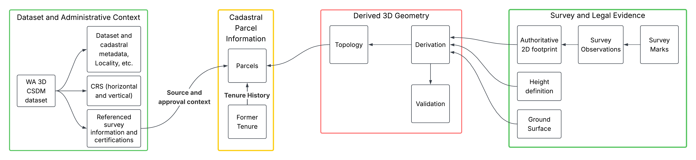

## 3D CSDM Derivation Diagram

Survey and legal source information are combined through a traceable derivation process to produce the topological 2D Polygons or 3D solids and Surfaces referenced by the cadastral parcel.

The file contains four main information groups:

1. dataset and administrative context;
2. cadastral parcels and tenure history;
3. survey and legal evidence;
4. topological geometry and derivation provenance.

<figure class="fig fig-wide">
  
  <figcaption id="figure-1-3d-csdm-content">Figure 1: 3D CSDM Content Diagram</figcaption>
</figure>
