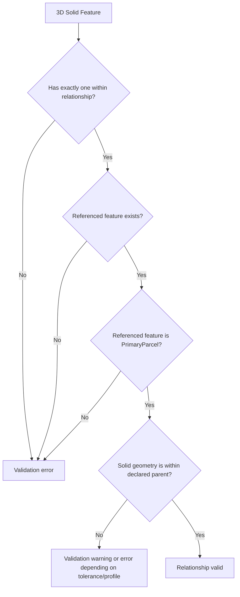

## Explicit Parent Parcel Relationships for 3D Solid Parcels

## Summary

The proposal is to explicitly record which Primary Parcel contains each 3D solid parcel using a within relationship on the solid’s topology object. 
This avoids relying only on geometric containment, which can become ambiguous after geometry edits, tolerance changes, or topology repairs. 
Each 3D solid would reference exactly one containing Primary Parcel, while a Primary Parcel may contain many solids. 
The relationship would then be validated through rules checking that the parent parcel exists, is the correct feature type, and spatially contains the solid under agreed tolerances.

## Discussion

This discussion considers how a 3D solid parcel should be associated with the Primary Parcel that contains it.

Although geometric containment can often be inferred from the spatial data, relying only on geometry can be fragile. 
The result may change after geometry edits, tolerance changes, or topology repairs. For cadastral management, the intended parent parcel should therefore be explicitly recorded and then validated against the geometry.

The proposed approach is to record this association as a `within` relationship on the 3D solid’s topology object. This is preferred over storing a `parentParcelID` property, because `within` describes a topological relationship rather than a simple identifier. It is also preferred over storing a reciprocal relationship on the Primary Parcel, because the reciprocal relationship can be derived by querying all solids that declare `within` that parcel.

The proposed rule is:

> Each 3D solid parcel must declare exactly one `within` relationship to the Primary Cadastral Parcel that contains it.
>
> A Primary Cadastral Parcel may contain zero, one, or many 3D solid parcels.
>
> 
In the following JSON we have described `within` as a `topological` `containing` relationship rather than a constraint.

```json
{
  "topology": {
    "type": "Solid",
    "shells": [
      {
        "ref": "uuid:1e877d2e-b9b0-4152-b693-fc4d76843142",
        "orientation": "+"
      }
    ],
    "relationships": [
      {
        "href": "uuid:458ba315-9601-4e0c-9385-f54c1e2372f6",
        "rel": "topology",
        "role": "containingPrimaryParcel",
        "targetFeatureType": "surv:PrimaryParcel"
      }
    ]
  }
}
```

Validation rules can then be applied as a constraint resulting from the relationship.

```json
{
  "rule": "solidWithinPrimaryParcel",
  "description": "Each Solid must have exactly one within relationship to an existing PrimaryParcel, and the Solid geometry should be geometrically within that PrimaryParcel according to the profile tolerance rules.",
  "cardinality": "exactlyOne",
  "targetClass": "PrimaryParcel",
  "geometryCheck": "withinOrCoveredByDeclaredParentParcel"
}
```
Using `within`/`containing` is consistent with common spatial and topological terminology. 
ISO 19107 supports interpreting `within`/`containing` as a spatial/topological relationship, and other standards such as GeoSPARQL also recognise relationship types such as `within`, `contains`, `overlaps`, `inside`, and `coveredBy`.

The `within`/`containing` relationship should be distinguished from the references used to construct the solid. 
The `shell` references define the solid’s geometric/topological construction. 
The `within`/`containing` relationship links the completed solid to another cadastral feature in the dataset.

Validation rules can then be applied to the declared relationship. 
These rules can test that the solid has exactly one declared parent parcel, that the referenced parcel exists, and that the referenced feature is a Primary Parcel. 
They can also test that the solid geometry is spatially within the declared parent parcel, according to agreed tolerances and geometric interpretation.

For this use case, `within`/`containing` means that the 3D solid is contained by the referenced Primary Parcel. 
Where the Primary Parcel is represented as a 2D parcel, the containment test must define whether the 2D parcel is interpreted as an unlimited vertical prism, a constrained height volume, or a footprint-only reference. 
The declared relationship remains the authoritative cadastral association, while the geometric test is used to validate consistency.

### Validation flow diagram


> The declared relationship is checked for cardinality, referential integrity, target type, and spatial consistency.

