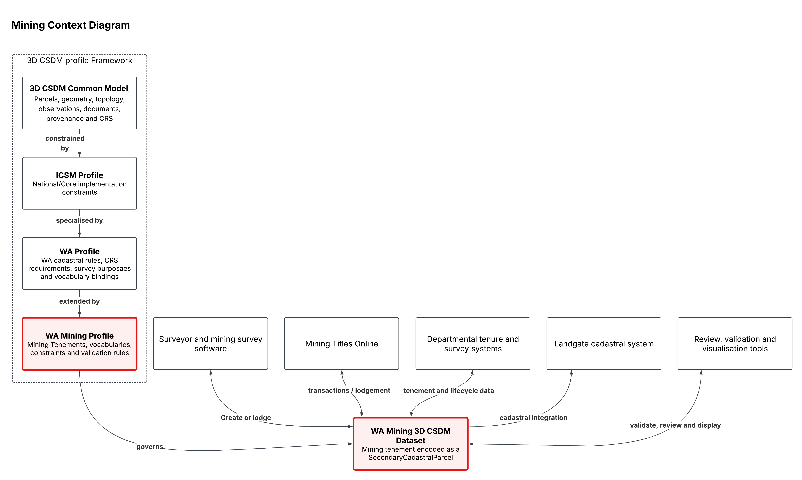

## Mining Profile Context Diagram

<figure class="fig fig-wide">
  
  <figcaption id="figure-1-mining-profile">Figure 1: Mining Profile Context Diagram</figcaption>
</figure>

The upper part shows profile inheritance:

3D CSDM Common Model **to** ICSM Profile **to** WA Profile **to** WA Mining Profile

Each layer reuses and further constrains the layer above it. 
The mining profile should add mining-specific vocabulary and validation rules rather than duplicate common model structures.

The lower part shows the implementation context. 
A conforming mining dataset sits between surveyors and systems such as MTO, departmental tenure systems and Landgate. 
The dataset remains the exchange object; the profile defines how it must be structured and validated.

A **Mining tenement** is a `SecondaryCadastralParcel`

A `SecondaryCadastralParcel` is a parcel representing the extent of a non-exclusive or partial right. 
Formally, it is an Incorporeal Hereditament, which includes things like easements, Licences, Profit &agrave; Prendre, etc.
Secondary parcels may overlap both primary parcels and other secondary parcels.