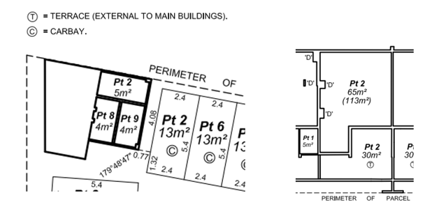

## Use case: Encode a WA multi-unit and/or multi-level built-strata scheme as a 3D CSDM dataset

## Revision history

| Version | Date       | Author        | Summary of change                                                                                                                                                                                                                                                                                                                                                                                                                                                                                                                                                                                            |
|---------|------------|---------------|--------------------------------------------------------------------------------------------------------------------------------------------------------------------------------------------------------------------------------------------------------------------------------------------------------------------------------------------------------------------------------------------------------------------------------------------------------------------------------------------------------------------------------------------------------------------------------------------------------------|
| 0.1     | 2026-05-06 | Andrew Hunter | Initial draft prepared.                                                                                                                                                                                                                                                                                                                                                                                                                                                                                                                                                                                      |
| 0.2     | 2026-06-03 | Andrew Hunter | Reframed common property and shared structures as display / interpretation information, not automatic cadastral database parcel volumes; added explicit handling for voids where current Landgate practice does not collect the feature; added OccupationMarks, SurveyPoint, descriptors and annotations; added strata element information: lot descriptions, unit entitlement, and boundary wording; revised the survey-strata conversion section to use a new lodged stage / integration model rather than a secondary conversion test; updated the alternative flows and acceptance outcomes accordingly. |

<!-- 
     Should line and colour styles be included in the 3D CSDM model? 
     Assumption is that if objects are encoded adequately, then visualisation styling should be left to the visualisation client application. 
     
     I think it is better to keep the data model/encoding seperate from the portrayal / styling rules. 

     A good rule is: Encode the semantic facts needed to style the data, but do not encode the styling itself as core data. 
-->

<!-- 
    Does WA legislation clearly state that all non-lot parts of a strata scheme are common property?

    > For WA strata schemes, common property should not be treated as an unexplained void. 
    > The Strata Titles Act 1985 defines common property as the part of the scheme parcel, and for strata schemes the relevant parts of the scheme building, that do not form part of a lot.
    >
    > The dataset may therefore represent common property either explicitly as common property geometry, or as an explicitly documented residual rule: scheme parcel/building extent minus lot extents. 
    > Where common property is not geometrically captured, the dataset should still record that the residual space is common property according to the scheme plan and statutory rule, rather than leaving it as an undocumented gap.

    So from a cadastral information perspective, common property is a thing that should be recognised.
    From this perspective, I think it is usually not sufficient to document only the explicit extent of individual rights and leave the extent of common rights undocumented.
    
    A better approach is to:

    > Document exclusive rights explicitly, and also document common rights or common property explicitly enough that their spatial extent, legal basis, and relationship to individual owners can be understood.

    The key reason is that absence of an individual right is not the same thing as a common right.

    For example, in a built strata scheme:

    | Space / object    | If only individual rights are documented         | Better cadastral interpretation                                             |
    | ----------------- | ------------------------------------------------ | --------------------------------------------------------------------------- |
    | Apartment lot     | Clear individual ownership extent                | Explicit private lot volume                                                 |
    | Corridor          | May appear as a void or unowned gap              | Common property / shared access area                                        |
    | Lift shaft        | May appear as empty space                        | Common property, service infrastructure, or shared vertical space           |
    | Structural wall   | May be ignored or treated as background geometry | Shared structure, common property, party wall, or boundary-defining element |
    | Roof / floor slab | May be visually present but legally ambiguous    | Common property, shared structure, or defined boundary surface              |

    So if the dataset only encodes individual lot volumes, a user can see where private ownership exists, but they may not be able to answer:

    Who has rights to the corridor?

    - Is the service riser common property or part of a lot?
    - Is the wall a lot boundary, common structure, or both?
    - Is the remaining space outside the lots legally common property, unallocated, or merely not modelled?
    - Is a void intentional, or is it a data omission?

    That is a serious issue if the goal is to understand the extent of owners’ rights.

    There is a difference between:

    1. not duplicating common rights for every owner, and
    2. not documenting common rights at all.

    It is reasonable to avoid repeating the same common right on every lot owner record. 
    But the common right or common property should still be represented once, with relationships to the scheme, lots, owners, or entitlement shares.

    > Private lots should be explicitly modelled. 
    > Common property and shared structures should also be explicitly modelled where they affect ownership, use, access, maintenance, or interpretation of the scheme.

    That is especially important in 3D because unmodelled space can be misread as:

    - a void;
    - an error;
    - unallocated space;
    - common property;
    - structural space;
    - service infrastructure;
    - or space outside the scheme.

    Those are legally and operationally different.
-->
### Description

A WA built-strata scheme may contain a multi-level apartment building, along with basement car bays or outdoor parking bays, storage areas, ground-floor access areas, upper-level residential lots, shared foyers, lifts, stairwells, external walls, slabs, ceilings, balconies, service areas, plant rooms, roof areas, and other building-related features.

The use case will demonstrate how a built-strata scheme can be represented as a 3D CSDM cadastral survey dataset. 
Each private strata lot is encoded as a 3D cadastral parcel, and legal lot boundaries are defined by reference to the building surfaces, levels, plan notations, boundary definition wording, and supporting survey evidence.

Common property, shared structures, service areas, and other building-related spaces are not automatically treated as cadastral parcel volumes. 
Where current Landgate practice does not collect these areas and add them to the cadastral database, they should continue to behave as uncollected spaces or voids for database integration purposes. 
The 3D CSDM dataset may still carry simplified display features, survey points, occupation marks, descriptors, and annotations needed to interpret or present the built-strata plan.

Landgate describes built-strata as schemes where lot boundaries, including height, are defined by reference to the building or buildings shown on the strata plan, while survey-strata lots are surveyed and shown on a survey-strata plan without buildings being shown [(Landgate, 2023)](https://www.landgate.wa.gov.au/strata-and-community-titles/strata-titles/learn-about-strata/strata-in-wa/).

`PrimaryParcel` boundaries may be described in accordance with Strata legislation. 
For example, following the Strata Titles Act 1985, [Schedule 2A, section 3AB](https://www.legislation.wa.gov.au/legislation/statutes.nsf/RedirectURL?OpenAgent&query=mrdoc_48587.pdf) results in statements similar to the following for single tier strata schemes:

> ...the boundaries of the lots or parts of the lots which are buildings on the strata plan are the external surfaces of those buildings.

## Relationship to existing use cases

This use case should be a companion use case, not a replacement for the existing set. 
It focuses on WA built-strata schemes where private strata lot extents are defined by building-referenced boundaries, vertical limits, plan wording, strata element information, and supporting survey or occupation evidence. 
Other use cases provide related patterns for height descriptions, derived solids, wall-boundary details, survey-strata conversion, infrastructure parcels, mining interests, terrain interaction, and natural boundaries.

| Related use case                                                                                 | Relationship to this use case                                                                                                                                                                                                                                                                                                                                                                              |
|--------------------------------------------------------------------------------------------------|------------------------------------------------------------------------------------------------------------------------------------------------------------------------------------------------------------------------------------------------------------------------------------------------------------------------------------------------------------------------------------------------------------|
| Represent a WA 2D parcel with height descriptions and derived 3D extent                          | Provides the general treatment of 2D, 2.5D, height-described, jurisdictionally bounded, and derived 3D representations, including `zMin`, `zMax`, height descriptions, AHD references, relative height references, vertical extent status, and legal-versus-derived geometry. Built-strata lots may reuse these concepts where plans define height, depth, floor, ceiling, or building-surface limits.     |
| Create a WA 3D CSDM extruded cadastral parcel from a 2D footprint and resolved height definition | Relevant where a built-strata lot, car bay, storage area, balcony, courtyard, or other lot component can validly be represented as a closed solid from a footprint and computable vertical limits. However, built-strata geometry should not be reduced to extrusion where the legal boundary is defined by walls, floors, ceilings, slabs, roof surfaces, or other building-referenced surfaces.          |
| Create a WA 3D CSDM Terrain Intersection Curve                                                   | May be relevant where a built-strata component, basement, courtyard, external part-lot, or other 3D parcel interacts with terrain or ground surface. The terrain-intersection curve is a derived relationship and should not replace building-referenced legal boundary surfaces or strata plan wording.                                                                                                   |
| Represent WA strata wall-boundary definitions between adjoining built-strata lots                | This is the closest detailed companion use case. It focuses on wall-specific boundary definitions such as centre plane, joined-building plane, inner surface of wall, upper surface of floor, and under surface of ceiling. The built-strata use case provides the broader scheme-level context; the wall-boundary use case provides detailed treatment of shared walls, wall evidence, and encroachments. |
| Encode a WA multi-unit, multi-level survey-strata scheme as a 3D CSDM dataset                    | Provides the contrasting pattern for survey-strata schemes, where boundaries are defined by survey dimensions and survey evidence rather than buildings. It is relevant for conversion from built strata to survey-strata, which should be treated as a new lodged stage rather than a direct transformation of the built-strata dataset.                                                                  |
| Encode WA tunnels, subsurface infrastructure, and airspace parcels as 3D CSDM datasets           | Relevant where a built-strata scheme is affected by tunnel parcels, subsurface infrastructure, airspace parcels, 3D easements, support rights, service corridors, or other plan-defined 3D interests. Those interests should remain distinct from private built-strata lot geometry unless the source plan explicitly links them.                                                                          |
| Encode a WA mining tenement survey dataset as a 3D CSDM mining profile                           | Generally separate, but relevant where a mining tenement, mining-related infrastructure, subsurface right, support right, exclusion zone, or affected-land relationship interacts with strata land or a built-strata parent parcel. Mining tenements should follow the mining-profile pattern and should not be confused with built-strata lot geometry.                                                   |
| Represent WA natural and general water boundaries as 3D CSDM datasets                            | Relevant where the parent parcel, scheme parcel, common-property context, or adjoining boundary of a built-strata scheme involves HWM, ordinary high water line, low water mark, watercourse centre thread, or another natural water boundary. Water-boundary evidence, annotations, AHD relationships, and ambulatory behaviour should follow the water-boundary use case.                                |

## Use case statement

**As a cadastral data editor, I want to encode a WA multi-unit, multi-level built-strata plan as a 3D CSDM dataset, so that each private strata lot, vertical boundary, building-referenced boundary, occupation mark, survey point, annotation, and supporting survey observation can be represented clearly, validated, displayed, and exchanged, while preserving Landgate's database treatment of common property and shared structures where these are not collected as cadastral parcel volumes.**

<!-- Should common property be treated as a first class object -->

## Purpose

The purpose of the use case is to test whether the WA 3D CSDM pattern can support a built-strata dataset where the important cadastral information is not only a horizontal parcel extent, but also:

| Dataset concern                | Why it matters                                                                                                                                                                                                                   |
|--------------------------------|----------------------------------------------------------------------------------------------------------------------------------------------------------------------------------------------------------------------------------|
| Multi-level parcels/3D solids  | Apartments, storage lots, balconies, courtyards and car bays may exist on different levels or in several spatial parts.                                                                                                          |
| Vertical boundaries            | Lot limits may be defined by floors, ceilings, slabs, walls, roof surfaces or AHD values.                                                                                                                                        |
| Building-referenced boundaries | Built-strata boundaries are often defined by reference to a building feature, such as the inner face of a wall, centreline of wall, floor surface, ceiling surface or other plan notation.                                       |
| Common property                | Common property may need to be identified for plan interpretation and display, but should not automatically be encoded as a cadastral parcel volume where Landgate practice treats it as uncollected space or void.              |
| Shared structures              | External walls, stairwells, lifts, roofs, foyers, driveways, service zones and similar structures may be captured as display, annotation, survey point or occupation mark information rather than as cadastral database volumes. |
| Survey evidence                | The model needs to preserve survey observations, adopted measurements, computations, provenance and supporting field information.                                                                                                |
| Strata element descriptions    | Lot descriptions, boundary definition wording, unit entitlement, and annotation information may need to be captured digitally to support display and review.                                                                     |

A key purpose of this use case is to test how the 3D CSDM can carry more information than is ultimately integrated into the cadastral database. 
The dataset may include display features, occupation marks, survey points, annotations, and descriptive information needed to interpret a built-strata plan, while the cadastral database may continue to store only the recognised cadastral parcel components.

Landgate notes that strata lots are volumetric spaces referenced to a building, while survey-strata lots are defined by dimensions and survey information and may be vertically limited or unlimited [(Landgate, 2020a)](https://www.landgate.wa.gov.au/land-and-property/land-transactions-hub/land-transaction-policy-and-procedure-guides/strata-titles/overview-of-strata-schemes/stp-02-lots/).

## Primary actor

Cadastral surveyor or cadastral data editor.

## Supporting actors

Landgate validator, scheme plan examiner, strata company, lot owner, 3D viewer user, downstream cadastral database user.

## Scenario

A registered WA strata plan contains:

| Level        | Content                                                                              |
|--------------|--------------------------------------------------------------------------------------|
| Basement     | car bays, storage lots, access ramps, services, common-property circulation areas    |
| Ground floor | entrance foyer, lift lobby, common driveway, plant room, private courtyard part-lots |
| Level 1      | residential Lots 1-6, balconies, shared corridor                                     |
| Level 2      | residential Lots 7-12, balconies, shared corridor                                    |
| Roof level   | common roof, plant area, solar equipment zone, possible exclusive-use area           |

The dataset must represent the private lot solids, building-referenced legal boundary surfaces, vertical stratum limits, and supporting survey evidence. 
It may also include common-property spaces, shared structural elements, service risers, occupation marks, survey points, and display annotations where these are needed to interpret or visualise the built-strata plan. 
These supporting elements should not automatically become cadastral database parcel volumes.

<figure class="fig fig-wide">
  
  <figcaption id="figure-1-strata-elements-example">Figure 1: Strata Elements Examples</figcaption>
</figure>

## Proposed 3D CSDM modelling pattern

| Real-world item                            | Suggested 3D CSDM representation                                                                                                                                                                                              |
|--------------------------------------------|-------------------------------------------------------------------------------------------------------------------------------------------------------------------------------------------------------------------------------|
| Whole strata scheme parcel                 | Parcel aggregate or scheme-level cadastral parcel grouping.                                                                                                                                                                   |
| Individual apartment lot                   | 3D `CadastralParcel`, usually a primary cadastral parcel.                                                                                                                                                                     |
| Car bay or storage lot                     | Separate 3D parcel, or part of the relevant lot where legally part of that lot.                                                                                                                                               |
| Lot spread across multiple levels          | Multi-part 3D parcel, with each part recorded as a spatial component of the same legal lot.                                                                                                                                   |
| Balcony or courtyard forming part of a lot | Part of the relevant lot solid, with its own vertical stratum limits where required.                                                                                                                                          |
| Common foyer, lift, stairwell, driveway    | Usually treated as uncollected common-property space or void in the cadastral database, unless legally required as a parcel component. May be included in the 3D CSDM dataset for display, annotation or plan interpretation. |
| External walls, slabs, ceilings, roof      | Represent as `OccupationMarks`, occupation/building evidence, simplified display features, or boundary reference information. Do not automatically treat as cadastral parcel volumes.                                         |
| Wall, floor or ceiling boundary            | Boundary face or surface used to define the 3D parcel shell, based on the plan wording.                                                                                                                                       |
| Shared wall or slab between two lots       | Single `BoundaryFace` used by both adjoining parcel solids, where the legal boundary is shared and the topology supports this.                                                                                                |
| Service riser                              | Leave as void in the cadastral database unless the plan creates a specific legal interest or parcel. Use `SurveyPoint`, annotation or descriptor information to support display and interpretation.                           |
| Building detail                            | Capture representative building-related surfaces only where needed to interpret legal boundaries. Do not require detailed capture of features such as windowsills, facade offsets or minor architectural detail.              |
| Easement or exclusive-use area             | Secondary cadastral parcel or interest-linked spatial object where the plan creates a legal interest or right over lots or common property.                                                                                   |
| Strata lot description                     | Descriptive or appellation component, preferably allowing free text where a prescribed vocabulary is too restrictive.                                                                                                         |
| Unit entitlement                           | Integer attribute recorded against the relevant parcel or digital plan component, where required.                                                                                                                             |
| Boundary definition wording                | Free-text boundary definition information, recorded at the plan header or individual element level depending on the scope of the wording.                                                                                     |
| Survey points and annotations              | `SurveyPoint` features or equivalent annotation information for points of interest, comments, descriptors, service riser references and field-note information.                                                               |
| Scheme plan metadata                       | CSD container metadata, survey purpose, survey type, CRS, vertical datum and provenance.                                                                                                                                      |

A `BoundaryFace` will be useful because the 3D CSDM defines it as the orientable surface where two solids touch, and notes that a single orientable boundary face can be used to define the boundary faces of both touching features [(ICSM, 2023a)](https://icsm-au.github.io/3d-csdm/docs/).

## Strata element information to be tested

The use case should also test whether the 3D CSDM can carry strata-specific descriptive information that supports plan interpretation and downstream display. 
This includes:

- lot description information, including free-text descriptions where a prescribed list is too restrictive;
- unit entitlement values, recorded as integers where required;
- boundary definition wording, such as "centreline of wall", "inner face of wall" or similar plan-specific descriptions;
- annotations and descriptors that support manual review of complex or unusual strata elements.

This information may be part of the parcel component, the appellation component, the 3D CSDM header, or another digital plan component depending on how the relevant 3D CSDM and WA profile structures are agreed.

## Main flow

1. _Create the WA 3D CSDM dataset container_:
The dataset is created as a cadastral survey dataset containing parcels, survey points, observations, occupation marks, supporting documents, display or annotation information, and provenance.  
The 3D CSDM describes a cadastral survey dataset as the set of cadastral survey data needed to integrate or transfer survey observations into a cadastral database [(ICSM, 2023a)](https://icsm-au.github.io/3d-csdm/docs/).

2. _Identify the parent scheme parcel_:
The freehold parent parcel is recorded as the land being subdivided by the strata scheme.

3. _Create the private strata lot solids_:
Each apartment, car bay, storage unit, balcony, courtyard, or other private lot component is encoded as a 3D parcel or part of a 3D parcel, according to the legal plan definition.

4. _Represent multi-level lots_:
Where a lot has parts on more than one level, the dataset keeps those parts linked to the same legal lot appellation.  
This reflects Landgate guidance that, for strata plans with lot parts on more than one floor level, it may be necessary to generate a table describing which levels specific part lots are on, along with relevant metadata such as part lot area [(Landgate, 2022)](https://www.landgate.wa.gov.au/land-and-property/land-transactions-hub/land-transaction-policy-and-procedure-guides/strata-titles/establishing-a-strata-scheme/stp-09-scheme-plans/).

5. _Define vertical boundaries_:
Lot solids are bounded by vertical and horizontal boundary faces. 
These may be derived from inner wall surfaces, centre planes of walls, upper floor surfaces, under-ceiling surfaces, slab levels, roof levels, or AHD-defined heights, depending on the plan wording.

6. _Identify common property and shared structures for display and interpretation_:
Common property and shared structures are identified where they are needed to understand the built-strata plan. 
This may include foyers, corridors, stairwells, lifts, service risers, driveways, external walls, roofs, and other spaces not included in private lots.  

These areas should not automatically be encoded as cadastral parcel volumes. 
Where current Landgate practice does not collect these features into the cadastral database, they should remain uncollected spaces or voids for database integration purposes. 
The 3D CSDM dataset may still include simplified occupation features, survey points, occupation marks, annotations, or descriptive information to support plan interpretation.  

Landgate describes common property as the part of the scheme parcel that is jointly owned and not contained within any private lot [(Landgate, 2023)](https://www.landgate.wa.gov.au/strata-and-community-titles/strata-titles/learn-about-strata/strata-in-wa/).

7. _Record occupation marks and building-referenced evidence_:
Walls, slabs, ceilings, columns, roof edges, building corners, and other building-related references are recorded as `OccupationMarks` or occupation/building evidence where they support the interpretation of built-strata boundaries.  

The cadastral boundary remains the legal surface or solid limit defined by the plan. 
The building feature (`occupationFeature`) is supporting evidence and should not automatically be treated as the cadastral boundary or as a cadastral parcel volume.

8. _Record survey points, descriptors, and annotations_:
Points of interest, comments, service riser references, building descriptors, field-note comments, and other non-boundary information may be recorded as part of `OccupationFeatures` or equivalent annotation information. 
These features support display, review, and interpretation but do not necessarily create cadastral database objects.

Examples may include service riser notes, building use descriptions, fence offset comments, points not found, field-record annotations, or other comments needed for manual review.

9. _Record strata element information_:
The dataset records strata-specific descriptive information where required. This may include lot descriptions, unit entitlement values, boundary definition wording, and other annotations needed to reproduce or interpret the plan.

10. _Attach survey observations and provenance_:
Measurements, adopted values, computations, plan references, source documents, surveyor information, and review information are recorded so that the lot geometry and supporting display information can be traced back to its evidence.  
The WA profile includes WA-specific bindings for items such as horizontal CRS, survey type, and survey purpose [(ICSM, 2023b)](https://icsm-au.github.io/3d-csdm/docs/wa-profile/).

11. _Validate the dataset_:
The dataset is checked to confirm that private lot solids close correctly, private lots do not overlap incorrectly, shared boundary faces are consistently referenced where used, vertical limits are clear, required strata element descriptions are present, and common property or shared structures are not incorrectly loaded as cadastral parcel volumes where they should remain voids in the database.

## Important distinction from survey-strata conversion

This use case focuses on **built-strata**, not survey-strata.

A later conversion to survey-strata should not be treated as a simple in-place transformation of the same dataset. 
Landgate requires a new submission, which becomes a new stage with the same land name and replaces the relevant cadastral elements once integrated.

The use case should therefore test whether the 3D CSDM can support staged submission behaviour:

- the built-strata dataset may exist as the current integrated representation;
- the later survey-strata dataset may be lodged as a new stage;
- the lodged stage may replace relevant built-strata elements when integrated;
- any vesting lots generated from the initial built-strata element should remain traceable where required.

Landgate conversion guidance is still useful because it highlights what changes when a strata scheme is converted to a survey-strata scheme. 
In a conversion, the intention is to enable the division of common property between existing strata lot owners, not to subdivide existing strata lots. 
Landgate also notes that, for survey-strata, buildings are not considered when assessing unit entitlement [(Landgate, 2020b)](https://www.landgate.wa.gov.au/land-and-property/land-transactions-hub/land-transaction-policy-and-procedure-guides/strata-titles/amending-a-strata-scheme/stp-14-conversion-of-strata-schemes-to-survey-strata-schemes/).

The revised secondary test is:

> Can the 3D CSDM represent a later survey-strata conversion as a new lodged stage that replaces relevant built-strata elements on integration, while preserving required lineage such as vesting lots?

## Alternative flows and edge cases

| Case                                                                     | Expected handling                                                                                                                                                                                                               |
|--------------------------------------------------------------------------|---------------------------------------------------------------------------------------------------------------------------------------------------------------------------------------------------------------------------------|
| Lot boundary is the inner surface of a wall                              | Boundary face is placed on the inner wall surface, with the wall retained as occupation/building evidence or an `OccupationMark` where useful.                                                                                  |
| Lot boundary is the centre plane of a party wall                         | Boundary face is placed at the centre plane and linked to both adjoining lots, where the topology supports shared boundary faces.                                                                                               |
| Lot extends over several levels                                          | Lot is represented as a multi-part 3D parcel under one legal appellation.                                                                                                                                                       |
| Balcony or courtyard is part of a lot                                    | Represent as part of the lot solid, with its own vertical stratum limits.                                                                                                                                                       |
| Balcony or roof area is common property with exclusive use               | Preserve common property treatment consistent with database practice, and link the exclusive-use right as an interest or secondary spatial object where legally required.                                                       |
| Service riser passes through private lots                                | Leave the riser as void in the cadastral database unless a specific legal parcel or interest is created. Use `SurveyPoint`, descriptor or annotation information in the 3D CSDM dataset to support display and interpretation.  |
| Common property or shared structure is not collected in current practice | Preserve current database behaviour by treating the area as void or uncollected space. Include simplified 3D CSDM display or annotation information only where useful.                                                          |
| Building feature does not match legal boundary                           | Capture a representative building feature only where needed to interpret the boundary. The vertical surface may be simplified. Fine architectural detail, such as windowsills or minor offsets, is not expected to be captured. |
| Boundary definition is expressed as plan wording                         | Record the wording as free text at the plan header or individual element level, depending on whether the wording applies to the whole scheme or only selected boundaries.                                                       |
| A prescribed vocabulary is too restrictive for lot descriptions          | Use a free-text description component where manual review is required, while still using controlled values where they are suitable for automation.                                                                              |
| Unit entitlement is required                                             | Record the unit entitlement as an integer against the relevant parcel or digital plan component.                                                                                                                                |
| Conversion to survey-strata is being tested                              | Treat the conversion as a new lodged stage with the same land name, replacing relevant elements when integrated. Do not treat this as a direct edit to the built-strata dataset.                                                |
| Vesting lot generated from initial built-strata                          | Preserve lineage and traceability for any vesting lot generated from the initial built-strata element.                                                                                                                          |

## Acceptance outcomes

1. _Each private strata lot is represented as a 3D cadastral parcel_:  
Each private lot has a legal appellation, parcel type, parcel purpose, geometry, and relationship to the parent scheme parcel.

2. _Multi-level lot parts remain legally connected_:  
Where a lot has parts on multiple levels, each part is spatially distinct but linked to the same legal lot.

3. _Vertical boundaries are explicit_:  
Floors, ceilings, wall faces, centre planes of walls, roof surfaces, slab levels, and AHD-defined heights are represented as explicit boundary surfaces or recorded boundary definitions.

4. _Common property and shared structures are handled consistently with Landgate database practice_:  
Common property, shared structures, service risers, and similar spaces are not automatically encoded as cadastral parcel volumes. Where current practice treats them as uncollected spaces or voids, that behaviour is preserved. The 3D CSDM may still carry display features, `SurveyPoint` annotations, descriptors, or `OccupationMarks` to support interpretation.

5. _Building evidence is separated from legal parcel geometry_:  
Building features are captured as representative occupation/building evidence, `OccupationMarks`, display features, or annotations. They do not automatically define cadastral parcel geometry unless the plan wording makes them the legal boundary reference.

6. _Shared boundaries are topologically consistent_:  
Where two lots share a wall, floor, ceiling, or slab boundary, the relevant boundary face is consistently referenced by both parcels where shared topology is used.

7. _Survey evidence and provenance are traceable_:  
Measurements, computations, adopted observations, source plans, survey activities, review decisions, and supporting documents are available for validation and audit.

8. _The dataset supports WA profile validation_:  
The dataset uses WA profile values for CRS, survey type, survey purpose, vertical datum, parcel classification, and other jurisdiction-specific metadata where required.

9. _Strata element descriptions are supported_:  
The dataset can record strata lot descriptions, boundary definition wording, and other descriptive information, including free text where prescribed values are insufficient.

10. _Unit entitlement can be recorded where required_:  
Unit entitlement values can be recorded as integer values against the relevant parcel or digital plan component.

11. _Survey points, occupation features, and annotations can support display without creating database parcels_:  
`SurveyPoint` features, `OccupationFeatures` descriptors, and annotations can be used to carry points of interest, comments, service riser notes, and other information needed for display or manual review without requiring those features to be loaded as cadastral parcel volumes.

12. _Staged survey-strata conversion behaviour is supported_:  
A later survey-strata conversion can be represented as a new lodged stage that replaces relevant built-strata elements on integration, while preserving required lineage such as vesting lots.

## Open confirmation points

1.  Should common property be captured only for 3D CSDM display and interpretation, or can it ever become a queryable cadastral volume in the database?
2.  What is the minimum acceptable level of building detail needed to support built-strata boundary interpretation?
3.  Should boundary definition wording be recorded at the scheme/header level, the individual boundary-face level, the individual parcel-part level, or a combination of these?
    _Recommendation:_ Scheme/header wording where the rule applies generally; boundary-level wording where the rule varies by wall, floor, ceiling or lot part.
4.  Confirm which fields should allow free text, and which should use controlled values.
    _Recommendation:_ controlled values for broad classifications such as `innerFace`, `centreLine`, `upperSurface`, `underSurface`, `AHDHeight`; free text for plan wording, examiner comments, historical wording, unusual strata descriptions, and manual review notes.
5.  We understand that the 3D CSDM should treat conversion to survey-strata as a new lodged stage, not as a direct transformation of the built-strata dataset.  
    5.1. How should the new stage be linked to the existing built-strata scheme;
    5.2. Should it use the same land name;
    5.3. Which elements are replaced on integration;
    5.4. Should superseded built-strata elements remain discoverable;
    5.5. how should any vesting lots from the initial built-strata element are preserved.
6. 
## References

- [ICSM (2023a) 3D Cadastral Survey Data Model (3D CSDM)](https://icsm-au.github.io/3d-csdm/docs/)
- [ICSM (2023b) WA Profile of the 3D CSDM](https://icsm-au.github.io/3d-csdm/docs/wa-profile/)
- [Landgate (2023) Strata in WA](https://www.landgate.wa.gov.au/strata-and-community-titles/strata-titles/learn-about-strata/strata-in-wa/)
- [Landgate (2022) STP-09 Scheme Plans](https://www.landgate.wa.gov.au/land-and-property/land-transactions-hub/land-transaction-policy-and-procedure-guides/strata-titles/establishing-a-strata-scheme/stp-09-scheme-plans/)
- [Landgate (2020a) STP-02 Lots](https://www.landgate.wa.gov.au/land-and-property/land-transactions-hub/land-transaction-policy-and-procedure-guides/strata-titles/overview-of-strata-schemes/stp-02-lots/)
- [Landgate (2020b) STP-14 Conversion of Strata Schemes to Survey Strata Schemes](https://www.landgate.wa.gov.au/land-and-property/land-transactions-hub/land-transaction-policy-and-procedure-guides/strata-titles/amending-a-strata-scheme/stp-14-conversion-of-strata-schemes-to-survey-strata-schemes/)
- [Western Australia (2026) Strata Titles Act 1985, Schedule 2A, section 3AB](https://www.legislation.wa.gov.au/legislation/statutes.nsf/RedirectURL?OpenAgent&query=mrdoc_48587.pdf)
