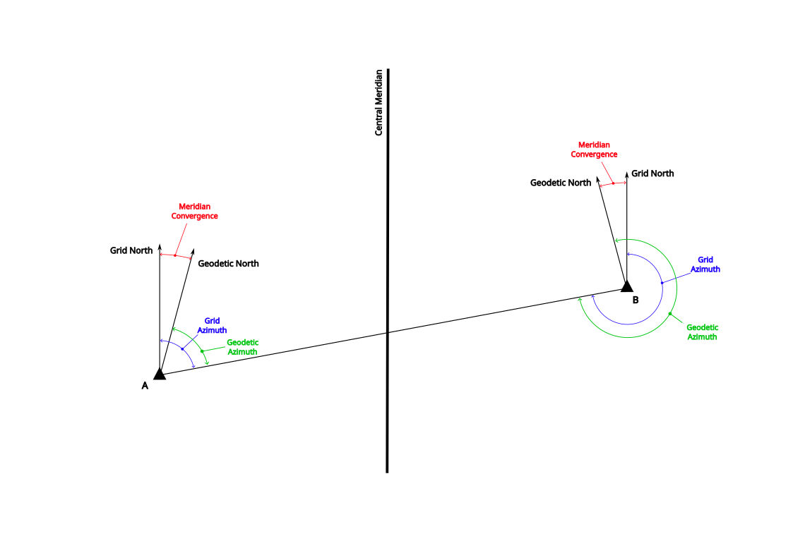

## Grid and Geodetic Azimuth

A **grid azimuth** is an azimuth measured on a projected coordinate reference system (CRS), clockwise from grid north (refer to the blue angles at A and B in Figure 1 below). 
It is a plane-coordinate direction and is normally derived from Cartesian coordinate differences, such as the change in easting and northing between two points. 

A **geodetic azimuth** is an azimuth measured on the geodetic reference ellipsoid, clockwise from geodetic north at the point of observation, along the geodesic between two points (refer to the green angles at A and B in Figure 1 below).
While grid directions are derived from Cartesian coordinate differences on a projected plane, geodetic observations are generally represented in a polar form on the reference ellipsoid.
Because geodetic azimuths are measured from the local meridian at each endpoint, the forward geodetic azimuth from Point A to Point B and the back geodetic azimuth from Point B to Point A will not generally differ by exactly 180 degrees. 
The meridians at the two endpoints are not parallel, and the geodesic between the points is defined on the curved ellipsoidal surface rather than on a flat grid. 
The difference from a simple 180-degree reciprocal is a normal consequence of ellipsoidal geometry and meridian convergence.

In Western Australia, the average of the forward and back geodetic azimuths, after allowing for the reciprocal direction, is commonly referred to as the mid-azimuth. 
The mid-azimuth is generally the value submitted by Land Surveyors for geodetic observations that form part of a cadastral dataset.

<figure class="fig fig-wide">
  
  <figcaption id="figure-1-grid-geodetic-azimuth">Figure 1: Grid and Geodetic Azimuth.</figcaption>
</figure>