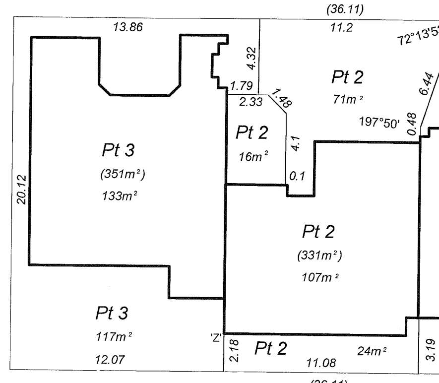
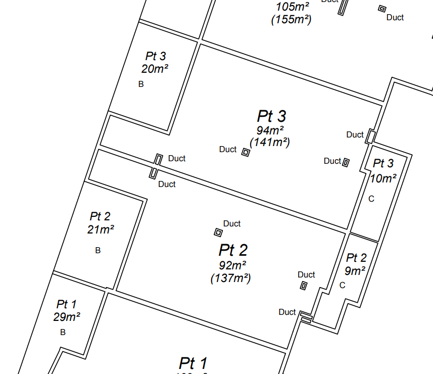

## Use case: Represent WA strata wall-boundary definitions between adjoining built-strata lots

## Revision history

| Version | Date       | Author        | Summary of change                                                                                                                                                                                                                                                                                                                                                 |
|---------|------------|---------------|-------------------------------------------------------------------------------------------------------------------------------------------------------------------------------------------------------------------------------------------------------------------------------------------------------------------------------------------------------------------|
| 0.1     | 2026-06-03 | Andrew Hunter | Initial party-wall draft.                                                                                                                                                                                                                                                                                                                                         |
| 0.2     | 2026-06-04 | Andrew Hunter | Broadened the use case from a single centre-plane party-wall case to a WA strata wall-boundary use case. Added client examples for centre-plane and inner-surface boundary definitions, separated field capture from database representation, added encroachment handling, and aligned common-property/shared-structure treatment with the built-strata use case. |

> **Note:** Display of strata wall boundaries between adjoining strata is a visualisation activity and is the responsibility of the visualisation application responsible for that activity.
> As such, this Use Case focuses on the encoding of the semantic facts needed to style the data but does not encode the styling itself as core data.
 
### Description

A WA strata scheme may contain adjoining built-strata lots where the legal boundary is defined by reference to a wall, a wall centre plane, the plane where two buildings are joined, the inner surface of a wall, the upper surface of a floor, the under surface of a ceiling, or other plan-specific boundary wording.

This use case demonstrates how a WA 3D CSDM dataset can represent these wall-related legal boundary definitions while keeping the following things distinct:

| Concern                               | Why it matters                                                                                                                                                                                                  |
|---------------------------------------|-----------------------------------------------------------------------------------------------------------------------------------------------------------------------------------------------------------------|
| Legal boundary surface                | The cadastral boundary is the legal plane or surface defined by the plan wording and legislation.                                                                                                               |
| Physical wall or building evidence    | The physical wall may have measurable thickness, faces, construction details and offsets. These support the boundary definition but are not always the cadastral boundary.                                      |
| Field survey capture                  | The wall may be captured in the field as measured faces, wall thickness, building corners, occupation marks or other evidence.                                                                                  |
| Cadastral database representation     | The database may store a reduced legal representation, such as a centreline/centre plane or inner-surface boundary face, rather than the full physical wall volume.                                             |
| Common property and shared structures | Shared structures may need to be shown for display and interpretation, but should not automatically become cadastral parcel volumes where current Landgate practice treats them as uncollected spaces or voids. |
| Encroachments                         | A wall, building, or material attached to a wall or building may encroach outside the parent parcel. This must be handled explicitly and should not cause a private lot to extend outside the parent parcel.    |

This use case is a focused companion to the broader [built-strata use case](./built-strata.md). 
It tests wall-specific boundary patterns that can occur within built-strata plans.

## Use case statement

**As a cadastral data editor, I want to encode WA built-strata lot boundaries that are defined by walls, wall centre planes, joined-building planes, floors, or ceilings, so that the dataset can distinguish the legal boundary surface, the surveyed physical building evidence, the plan presentation, the database representation, and any common-property or encroachment context.**

### Primary actor

Licensed cadastral surveyor or cadastral data editor.

### Supporting actors

Landgate validator or approver, scheme plan examiner, strata company, lot owners, downstream 3D viewer or cadastral database user.

### Scenario

A strata scheme contains two adjoining built-strata lots. The lots are separated by a wall or building element. 
Depending on the plan wording and legal basis, the boundary may be:

1. the centre plane of a common or party wall;
2. the plane on which two buildings are joined;
3. the inner surface of each wall;
4. the upper surface of a floor;
5. the under surface of a ceiling; or
6. another surface, plane, level, or notation defined by the scheme plan.

The dataset must show:

1. the 3D solid extent of each private lot;
2. the legal boundary face or faces between the lots;
3. the boundary basis, such as centre plane, joined plane, inner wall surface, floor surface, or ceiling surface;
4. the physical wall or building evidence used to support the boundary definition;
5. the relationship between the boundary face and the affected lot or lots;
6. any relevant common-property, shared-structure, void, or uncollected-space treatment;
7. any encroachment outside the parent parcel and associated easement or management treatment; and
8. the provenance, CRS, vertical datum, survey observations, annotations, and WA profile vocabulary values needed to validate and exchange the dataset.


## Client examples / plan interpretation examples

### Example 1: Centre-plane party wall or joined buildings

Where two lots have a common or party wall, or have buildings that are joined, the centre plane of that wall, or the plane on which the buildings are joined, may be the boundary. 
In current plan practice this may be shown as a single thick line at the centreline.

In the 3D CSDM dataset, this is represented as one shared legal `BoundaryFace`. 
The surveyed physical wall faces, wall thickness, offsets from wall faces to centre plane, construction information, and uncertainty are retained as occupation or building evidence.

<figure class="fig fig-wide">
  
  <figcaption id="figure-1-party-wall-centre-plane">Figure 1: Centre-plane party wall example. The plan may show a single thick centreline, while the 3D CSDM representation records one shared legal boundary face and separate physical wall evidence.</figcaption>
</figure>

### Example 2: Inner wall, floor, and ceiling surfaces

Where the plan states that the boundaries of the lots or parts of lots which are buildings are the inner surfaces of the walls, the upper surfaces of the floors, and the under surfaces of the ceilings, each lot boundary is represented by the relevant building surface. 
In current plan practice this may be shown using two thin lines or other wall-face drafting conventions.

In the 3D CSDM dataset, each lot has its own boundary face where the legal boundary is the inner wall surface. 
The wall volume between those faces is not automatically part of either private lot unless the plan or legislation provides otherwise. 
It may be treated as occupation/building evidence, shared structure, common property, uncollected space, void or annotation/display information according to the plan and Landgate database practice.

<figure class="fig fig-wide">
  
  <figcaption id="figure-2-inner-surface-wall">Figure 2: Inner-surface wall boundary example. Each lot is bounded by its own wall surface. The intervening wall is treated as building evidence, common property, shared structure, uncollected space, or void depending on the plan and database practice.</figcaption>
</figure>

## Proposed 3D CSDM modelling pattern

| Real-world / legal item                                  | Suggested 3D CSDM representation                                                                                                                                                                                                                 |
|----------------------------------------------------------|--------------------------------------------------------------------------------------------------------------------------------------------------------------------------------------------------------------------------------------------------|
| Parent scheme parcel                                     | Scheme-level parcel or parcel aggregate containing the strata scheme.                                                                                                                                                                            |
| Lot 1 and Lot 2                                          | 3D `CadastralParcel` / `PrimaryParcel` solids or multi-part solids.                                                                                                                                                                              |
| Centre-plane party wall boundary                         | One shared `BoundaryFace` located at the centre plane of the wall.                                                                                                                                                                               |
| Joined-building boundary                                 | One shared `BoundaryFace` located at the plane where the buildings are joined.                                                                                                                                                                   |
| Inner wall surface boundary                              | A `BoundaryFace` for the relevant lot located on the inner wall surface. This is not necessarily shared with the adjoining lot.                                                                                                                  |
| Floor boundary                                           | Horizontal `BoundaryFace` located at the upper surface of the floor, where that is the legal boundary.                                                                                                                                           |
| Ceiling boundary                                         | Horizontal `BoundaryFace` located at the under surface of the ceiling, where that is the legal boundary.                                                                                                                                         |
| Physical wall captured in field survey                   | `OccupationMark`, `OccupationFeature`, occupation/building evidence, survey observation, offset evidence, descriptor or annotation.                                                                                                              |
| Wall thickness and measured faces                        | Survey observations or occupation evidence used to derive the legal boundary surface.                                                                                                                                                            |
| Relationship between shared wall face and adjoining lots | `touchesInward` / `touchesOutward`, or equivalent topological relationship from the oriented boundary face to the adjoining parcel solids.                                                                                                       |
| Database representation                                  | Reduced legal boundary representation, such as a centreline/centre plane or inner-surface face, depending on the plan wording.                                                                                                                   |
| Common property or shared structure                      | Not automatically a parcel volume. Represent explicitly only where required, or record as display/evidence/annotation consistent with Landgate database practice.                                                                                |
| Encroachment outside parent parcel                       | Encroachment feature, occupation/building evidence or annotation that identifies the nature and extent of the encroachment and any required easement or management treatment. Do not model a private lot as extending outside the parent parcel. |
| Legal description of each lot                            | `Appellation` and strata element description using WA profile naming and description rules.                                                                                                                                                      |
| Boundary definition wording                              | Free-text or structured boundary-basis attribute, such as `centrePlaneOfWall`, `joinedBuildingPlane`, `innerSurfaceOfWall`, `upperSurfaceOfFloor` or `underSurfaceOfCeiling`, subject to agreed WA vocabulary.                                   |
| Scheme, survey, approval and source history              | Survey provenance bundle, including survey activity, survey agent, lifecycle activity, source plan, calculations and review information.                                                                                                         |

A `BoundaryFace` remains a good fit where the legal boundary is an orientable surface between solids. 
Where the boundary is genuinely shared, a single orientable boundary face can be referenced by both touching features. 
Where the legal boundaries are instead the inner wall surfaces of each lot, the use case should not force a single shared boundary face merely because the lots are physically adjacent.

## Strata element information to be tested

The use case should test whether the 3D CSDM can carry wall-specific strata element information needed for plan interpretation, validation, and display. 
This includes:

- boundary definition wording, such as `centreline of wall`, `centre plane of wall`, `plane on which buildings are joined`, `inner surface of wall`, `upper surface of floor` or `under surface of ceiling`;
- the legal basis for the boundary definition, where available;
- whether the boundary basis applies to the whole scheme, a level, a building part, or a selected lot boundary;
- whether the wall/building feature was captured as part of the field survey and then reduced to a legal boundary plane for plan/database purposes;
- wall thickness, measured wall faces, offsets to centre plane, and uncertainty;
- occupation marks, survey points, descriptors, and annotations supporting the wall boundary; and
- common-property, shared-structure, void, uncollected-space, or encroachment treatment.

This information may be recorded at the parcel, boundary face, occupation feature, observation, plan header, annotation, or provenance level depending on the final 3D CSDM and WA profile implementation pattern.

## Main flow

1. _Create the WA 3D CSDM dataset container_:  
The dataset is created as a cadastral survey dataset containing parcels, boundary faces, survey points, observations, occupation marks, supporting documents, display or annotation information, and provenance.

2. _Identify the parent scheme parcel_:  
The parent parcel or scheme parcel is recorded as the land being subdivided by the strata scheme. The private lot solids must remain within the parent parcel unless a legally supported encroachment or other treatment is explicitly represented as an encroachment rather than ordinary lot geometry.

3. _Create the private strata lot solids_:  
Lot 1 and Lot 2 are represented as 3D cadastral parcels or 3D spatial components of cadastral parcels. Each parcel has its own appellation, parcel type, parcel purpose, geometry, interest reference, and relationship to the parent scheme parcel.

4. _Determine the legal boundary basis from the plan wording_:  
The dataset records whether the relevant boundary is based on the centre plane of a party wall, the plane on which two buildings are joined, the inner surface of a wall, the upper surface of a floor, the under surface of a ceiling, an external surface, an AHD-defined level, or another plan-defined surface.

5. _Define the centre-plane or joined-building boundary, where applicable_:  
If the legal boundary is the centre plane of a party wall or the plane on which the buildings are joined, a single vertical `BoundaryFace` is created at that plane. Its horizontal and vertical extent follow the plan wording, relevant wall/building evidence, and any stated height or level limits.

6. _Define inner-surface wall, floor, or ceiling boundaries, where applicable_:  
If the legal boundary is the inner surface of a wall, upper surface of a floor or under surface of a ceiling, each lot is bounded by the relevant surface. The intervening wall, floor slab, ceiling void, or structural material is not automatically assigned to either lot unless the plan creates that legal effect.

7. _Link boundary faces to the affected lots_:  
Where a boundary face is shared, the face is linked to both adjoining lots using `touchesInward` / `touchesOutward`, or an equivalent topological relationship. Where the boundary faces are not legally shared, each lot references its own legal boundary face.

8. _Record physical wall and building evidence separately_:  
The actual wall thickness, construction, measured faces, offsets from wall faces to centre plane, building corners, occupation marks, and any uncertainty are recorded as occupation/building evidence, survey observations, adopted observations, descriptors, or annotations. This avoids confusing the physical wall volume with the legal boundary surface.

9. _Record field capture, plan product, and database representation_:  
The dataset records, where useful, that the physical wall was captured in field survey but reduced for plan and database purposes. For example, the field survey may record two wall faces and wall thickness, the plan product may show a single thick centreline, and the cadastral database may store the legal centre plane. Alternatively, the plan product may show two thin lines and the cadastral database may store inner-surface boundary faces.

10. _Identify common property and shared structures for display and interpretation_:  
Walls, slabs, service spaces, and shared structural elements are identified where needed to interpret the plan. They should not automatically be encoded as cadastral parcel volumes. Where current Landgate practice does not collect these features into the cadastral database, they should remain uncollected spaces or voids for database integration purposes. The 3D CSDM dataset may still include simplified occupation features, survey points, occupation marks, annotations, or descriptive information to support plan interpretation.

11. _Record encroachments outside the parent parcel, where applicable_:  
If part of a wall or building, or material attached to a wall or building, encroaches beyond the surface boundaries of the parent parcel, the dataset records the nature and extent of the encroachment. It also records whether the encroachment is to be managed as common property, managed as if it were part of a specified lot, or is subject to an easement. Private lot geometry should not be treated as extending outside the parent parcel unless the legal treatment is explicitly represented and validated.

12. _Record source and provenance_:  
The dataset records the survey activity, surveyor, source plan, field observations, calculations, adopted values, client-supplied examples, plan notations, review comments, and any decisions used to derive the legal boundary surfaces.

13. _Validate the dataset_:  
Validation checks confirm that the lot solids close correctly, private lots do not overlap incorrectly, shared boundary faces are consistently referenced where used, inner-surface boundary faces are not falsely treated as shared centre-plane boundaries, boundary definition wording is present, field evidence is traceable, and encroachments are explicitly identified and handled.

## Alternative flows and edge cases

| Case                                                                        | Expected handling                                                                                                                                                                                                                                                                                                     |
|-----------------------------------------------------------------------------|-----------------------------------------------------------------------------------------------------------------------------------------------------------------------------------------------------------------------------------------------------------------------------------------------------------------------|
| Centre-plane party wall                                                     | One shared legal `BoundaryFace` is placed at the centre plane of the wall and referenced by both lot solids. Physical wall faces and thickness are retained as occupation evidence.                                                                                                                                   |
| Joined buildings                                                            | One shared legal `BoundaryFace` is placed at the plane where the buildings are joined.                                                                                                                                                                                                                                |
| Inner-surface wall boundary                                                 | Each lot is bounded by its own inner wall surface. Do not force a shared `BoundaryFace` unless the legal boundary is actually shared.                                                                                                                                                                                 |
| Floor or ceiling boundary                                                   | Use horizontal boundary faces representing the upper surface of the floor or under surface of the ceiling, as stated by the plan wording.                                                                                                                                                                             |
| Physical wall captured in field survey but reduced to centreline            | Store measured wall observations, thickness and offsets as evidence. Store the legal boundary as the centre plane for cadastral and database purposes.                                                                                                                                                                |
| Physical wall or building feature does not match the legal boundary exactly | Store the building feature as supporting evidence. The cadastral boundary remains the legal surface or solid limit defined by the plan.                                                                                                                                                                               |
| Wall/common structure not collected in current database practice            | Preserve database behaviour by treating it as uncollected space, void, display feature, occupation mark or annotation unless the plan creates a recognised cadastral object.                                                                                                                                          |
| Wall is common property rather than part of either lot                      | Represent the wall or related space as common property only where required by the scheme plan or agreed modelling pattern. Otherwise record it as shared structure, display information, occupation evidence or uncollected space as appropriate.                                                                     |
| Wall forms part of a non-exclusive right or burden                          | Consider a secondary parcel or interest-linked spatial object where the plan creates a non-exclusive right or burden.                                                                                                                                                                                                 |
| Wall, building or attached material encroaches outside the parent parcel    | Do not model a private lot as extending outside the parent parcel. Record the encroaching wall/building/attachment as an encroachment feature or occupation/building evidence. Identify the nature and extent of the encroachment and any required management treatment or easement.                                  |
| Encroachment managed as common property                                     | Represent the encroachment and record that it is to be controlled and managed as if it were common property. Link to any supporting plan notation, certificate or easement evidence.                                                                                                                                  |
| Encroachment managed as part of a specified lot                             | Represent the encroachment and record that it is to be controlled and managed as if it were part of the specified lot or lots. Link to any required easement evidence.                                                                                                                                                |
| Encroachment onto a public road, street or way                              | Record the encroachment and flag for jurisdiction-specific treatment and validation. Do not assume the same easement treatment as an encroachment onto private land.                                                                                                                                                  |
| Legacy / old Form 5 certification evidence is supplied                      | Treat the old Form 5 wording as legacy source evidence. Translate the relevant facts into structured data: all lots are within the external surface boundaries of the parcel, the plan indicates the existence, nature and extent of the encroachment, and any required easement or management treatment is recorded. |
| Boundary definition is expressed as plan wording                            | Record the wording as free text at the plan header, lot, boundary face or annotation level depending on whether it applies to the whole scheme or only selected boundaries.                                                                                                                                           |

## Acceptance outcomes

1. _Boundary basis is explicit_:  
Each wall-related boundary records whether it is defined by centre plane, joined-building plane, inner wall surface, floor surface, ceiling surface, external building surface, AHD height, or other plan wording.

2. _Centre-plane cases use shared topology_:  
Where the legal boundary is the centre plane of a party wall or joined-building plane, one shared `BoundaryFace` is referenced by both lots using inward/outward or equivalent topological relationships.

3. _Inner-surface cases do not falsely share topology_:  
Where the legal boundaries are the inner wall surfaces, each lot has the relevant inner-surface boundary face. The intervening wall volume is not incorrectly assigned to either lot.

4. _Floor and ceiling boundaries are explicit_:  
Where the legal boundary is the upper surface of the floor or the under surface of the ceiling, the relevant horizontal boundary face is represented or recorded as a boundary definition.

5. _Physical wall evidence is retained separately_:  
Field-captured wall faces, wall thickness, offsets, construction information, occupation marks, and uncertainty are retained as occupation/building evidence or observations.

6. _Database representation is clear_:  
The use case distinguishes field-captured physical evidence from the reduced legal representation stored in the plan product or cadastral database.

7. _Common property and shared structures are handled consistently with Landgate database practice_:  
Common property, shared structures, and service spaces are not automatically encoded as cadastral parcel volumes. Where current practice treats them as uncollected spaces or voids, that behaviour is preserved. The 3D CSDM may still carry `SurveyPoint` annotations, descriptors, or `OccupationMarks` to support interpretation.

8. _Encroachments are explicitly handled_:  
The dataset can identify the nature and extent of any wall, building or attached material that encroaches outside the parent parcel, and records whether it is managed as common property, managed as part of a lot, or subject to an easement.

9. _Private lots remain within the parent parcel_:  
Validation prevents private lot solids from extending outside the parent parcel, except where a legally supported encroachment, easement, or management treatment is explicitly represented as an encroachment rather than ordinary lot geometry.

10. _Survey evidence and provenance are traceable_:  
Measurements, computations, adopted observations, source plans, client example images, plan notations, survey activities, review decisions, and supporting documents are available for validation and audit.

11. _The dataset supports WA profile validation_:  
The dataset uses WA profile values for CRS, survey type, survey purpose, vertical datum, parcel classification, appellation, and other jurisdiction-specific metadata where required.

12. _Strata element descriptions are supported_:  
The dataset can record strata lot descriptions, boundary definition wording, and other descriptive information, including free text where prescribed values are insufficient.

13. _Images can support interpretation without becoming geometry_:  
Client-supplied images can be included as figures or supporting documents. They help explain the use case and plan convention, but they do not replace the structured legal boundary, observation, and provenance information.

## Open confirmation points

The following points need to be confirmed with Landgate before the use case is finalised:

1. Whether the WA profile should use controlled vocabulary values for wall-boundary basis, or whether free text is sufficient for this test case.
2. Whether common-property/shared-structure wall space should be represented explicitly in the 3D CSDM dataset, or only as display/interpretation information, when it is not loaded into the cadastral database.
3. How old Form 5 wording should be referenced in modern digital submissions, especially where the same substantive certification facts are now represented through current scheme plan requirements, easement documentation, or Landgate procedures.

Illustrative example:
```json
{
  "certificationAssertions": [
    {
      "type": "lotContainment",
      "assertion": "allLotsWithinParentParcel",
      "result": true,
      "appliesTo": ["Lot 1", "Lot 2"],
      "basis": "currentSchemePlanRequirement",
      "legacyReference": "Former Form 5 certificate wording",
      "evidence": ["schemePlan", "surveyObservations", "parentParcelBoundary"]
    },
    {
      "type": "encroachmentDisclosure",
      "assertion": "encroachmentIdentifiedAndDescribed",
      "result": true,
      "encroachmentFeature": "encroachment-001",
      "nature": "wall encroachment",
      "extentGeometry": "encroachment-001-geometry",
      "basis": "currentSchemePlanRequirement",
      "legacyReference": "Former Form 5 certificate wording"
    },
    {
      "type": "encroachmentManagement",
      "assertion": "encroachmentManagementTreatmentSpecified",
      "result": true,
      "managementTreatment": "controlledAndManagedAsCommonProperty",
      "basis": "Strata Titles Act / scheme plan requirement"
    },
    {
      "type": "easementRequirement",
      "assertion": "appropriateEasementRequiredAndIdentified",
      "result": true,
      "easementReference": "Easement E-1",
      "status": "lodged",
      "appliesWhere": "encroachment is not onto a public road, street or way"
    }
  ]
}
```

## References

- [ICSM (2023a) 3D Cadastral Survey Data Model (3D CSDM)](https://icsm-au.github.io/3d-csdm/docs/)
- [ICSM (2023b) ICSM profile of the 3D CSDM](https://icsm-au.github.io/3d-csdm/docs/icsm-profile/)
- [ICSM (2023c) WA profile of the 3D CSDM)](https://icsm-au.github.io/3d-csdm/docs/wa-profile/)
- [Landgate (2023) STP-03 Common Property](https://www.landgate.wa.gov.au/land-and-property/land-transactions-hub/land-transaction-policy-and-procedure-guides/strata-titles/overview-of-strata-schemes/stp-03-common-property/)
- [Landgate (2022) STP-09 Scheme Plans](https://www.landgate.wa.gov.au/land-and-property/land-transactions-hub/land-transaction-policy-and-procedure-guides/strata-titles/establishing-a-strata-scheme/stp-09-scheme-plans/)
- [Landgate (2020) STP-02 Lots](https://www.landgate.wa.gov.au/land-and-property/land-transactions-hub/land-transaction-policy-and-procedure-guides/strata-titles/overview-of-strata-schemes/stp-02-lots/)
- [Surround (2026) Use case: Encode a WA multi-unit and/or multi-level built-strata scheme as a 3D CSDM dataset](./built-strata.md)
- [Western Australia (2026a) Strata Titles (General) Regulations 2019](https://www.legislation.wa.gov.au/legislation/statutes.nsf/RedirectURL?OpenAgent=&query=mrdoc_45270.pdf)
- [Western Australia (2026b) Strata Titles Act 1985](https://www.legislation.wa.gov.au/legislation/statutes.nsf/RedirectURL?OpenAgent=&query=mrdoc_45344.pdf)

